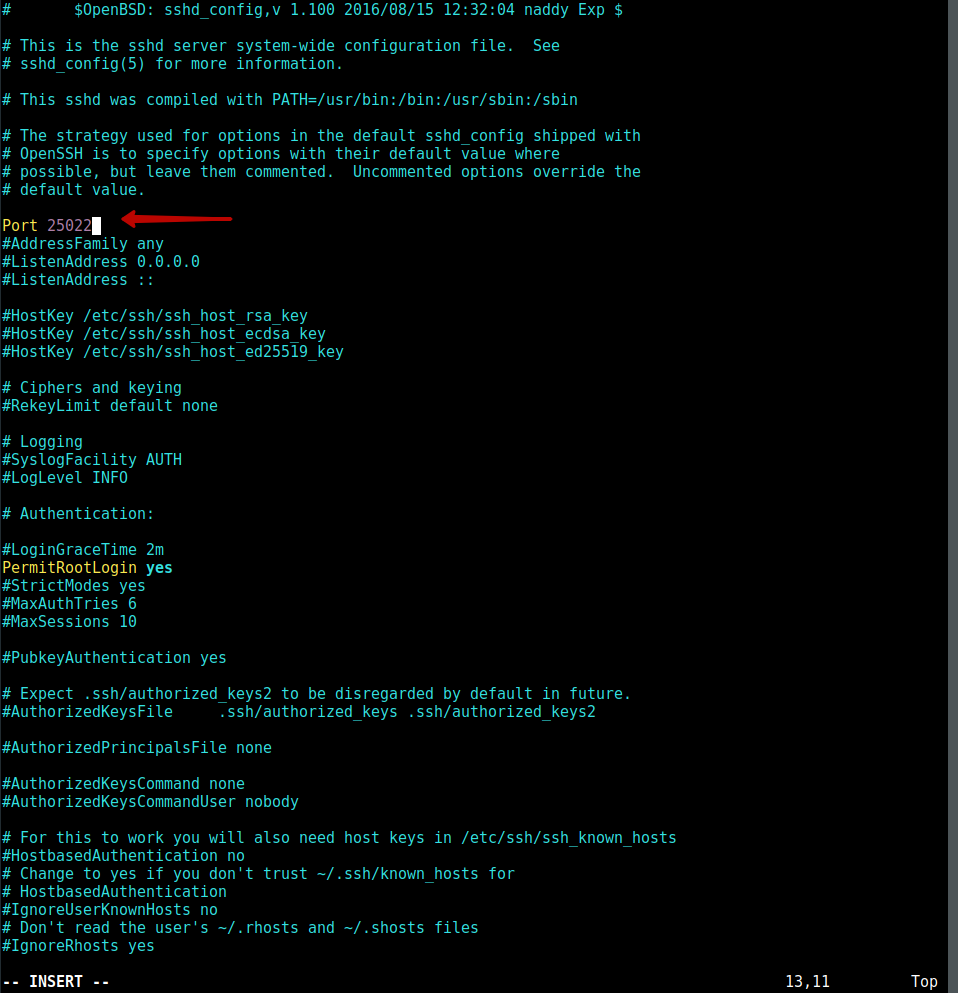

## Изменение порта для подключения по SSH

Чтобы изменить порт для подключения по SSH необходимо отредактировать файл конфигурации SSH демона. Откроем данный файл текстовым редактором:
```sh
vim /etc/ssh/sshd_config
```
Найдем строку `Port 22` и изменим её, указав новый порт для подключения. Например `Port 25022`.

Выходим, сохраняем файл и перезагружаем SSH следующей командой:
```sh
service sshd restart
```
После перезапуска SSH, он станет доступен по новому порту, а текущая сессия на старом останется активной. Поэтому не отключаясь для проверки попробуем подключится по новому порту - если не пускает, то возможно в системе работает фаервол и нужно в нем разрешить новый порт, например в iptables это делается так (где 25022 наш новый порт):
```sh
iptables -A INPUT -p tcp --dport 25022 -j ACCEPT
```
Можно разрешить средствами iptables подключение к SSH только с указанного диапазона IP адресов:
```sh
iptables -A INPUT -d 192.168.0.0/24 -p tcp --dport 25022 -j ACCEPT
```
где 192.168.0.0/24 - IP адрес сети и маска сети, с которых разрешено подключение по SSH.
Далее проверяем подключение по SSH на новом порту `ssh <user>@<ip> -p <port>` - если подключение выполняется, то можем удалить правило `iptables` подключения по SSH по старому порту:
```sh
iptables -D INPUT -p tcp --dport 22 -j ACCEPT
```
Посмотреть в системе на каком порту и на каких сетевых интерфейсах работает SSH можно следующей командой:
```sh
netstat -tulpan | grep ssh
```

## Источники

1. [Как изменить порт SSH в Ubuntu](https://ixnfo.com/kak-izmenit-port-ssh-v-ubuntu.html)