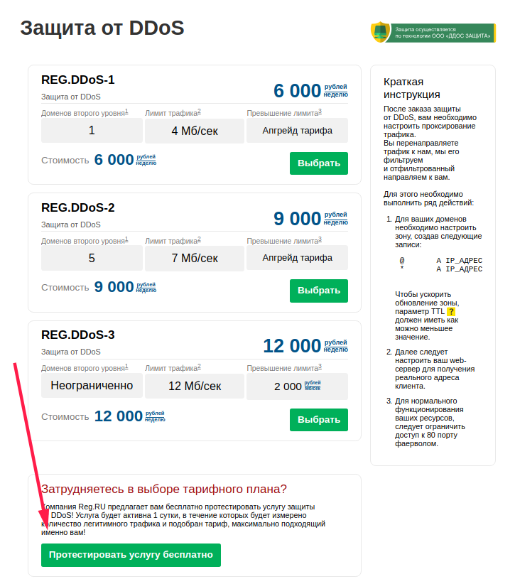

>DDoS (Distributed Denial of Service) — распределённая атака типа «отказ в обслуживании». Сетевой ресурс выходит из строя в результате множества запросов к нему, отправленных из разных точек.

## DDoS Guard

Обычные методы защиты от DDoS-атак не позволяют избежать временной недоступности сайтов. Специалисты DDoS Guard разработали технологию, которая срабатывает автоматически и способна выдержать атаку со скоростью более 100 Гбит/с.
DDoS-Guard предоставляет защиту для следующих классов трафика:
IP malformed;
ICMP flood;
TCP SYN flood;
TCP-malformed;
ICMP smurf.
Для защиты от классов атак типа «HTTP flood» и «HTTPS flood» необходимо подключать дополнительную платную услугу DDoS Protection: https://www.reg.ru/web-tools/ddosprotection/plans

На серверах, которые расположены в дата-центре Exepto (REG.RU 30XXX) по-умолчанию DDoS-Guard активна на всех серверах. На серверах ACOD и DataPro защита от DDoS-атак отсутствует, но её возможно подключить путём выделения IP адреса из защищенной подсети: пул защищенной подсети `DEDIC_CLIENT_ACOD_VLAN_ANTIDDOS`.

### Заявка на подключение DDoS-Guard
После того, как клиент составляет заявку в службу технической поддержки с уведомлением о необходимости подключения услуги DDoS-Guard, необходимо:
1. Выполнить заказ дополнительного IP-адреса из личного кабинета. Инструкция по заказу дополнительного IP для сервера: [Как подключить дополнительные IP-адреса для выделенного сервера?](https://www.reg.ru/support/hosting-i-servery/dedicated/zakaz-i-nastrojka-vydelennogo-servera/kak-podklyuchit-dopolnitelnye-ip-adresa-dlya-vydelennogo-servera)
2. После того, как IP заказан необходимо составить письмо на noc@reg.ru (в копию поставь cloud-core@reg.ru и colo-admin-team@dev.reg.ru) с просьбой выделить IP из защищенной подсети (указать маску и шлюз для него). В запросе указываем номер сервера и его основной IP-адрес.
3. Данные IP (IP-адрес, маска, шлюз) отправляем клиенту.
4. В Sd услуги дополнительного IP адреса необходимо заменить выданные автоматически параметры (IP адрес, маска, шлюз) на данные, которые дали сетевые инженеры (noc@reg.ru).
5. После этого клиенту необходимо прописать данный IP-адрес, как IP-allis на сетевой интерфейс:
 - Посредством ISPmanager 5: в разделе "Настройки", нажать **IP-адреса**, нажать **Создать**. Ввести выданный IP в поле IP-адрес.
 - Посредством консоли операционной системы, как описано в стате [Настройка дополнителых IP-адресов в Linux](https://cloud-core.ru/ru/kb/ustanovka-dopolnitelyh-ip-adresov-v-linux)
6. Для защиты доменного имени необходимо:
 - Посредством панели ISPmanager: в разделе "Домены" нажать **WWW-домены**, выбрать домен и нажать **Изменить**, напротив **IP-адрес** раскрыть список IP-адресов и выбрать дополнительный IP-адрес, который был ранее добавлен на сервер в панели ISPmanager, применить изменения, нажав **Ок**.
 - Посредством консоли операционной системы: необходимо конфигурировать VirtualHost доменного имени для существующего/существующих web-сервера/web-серверов.

При существующей заявке с вопросом о услуге и функционировании защиты от DDoS-атак можно использовать следующий шаблон:
>Защита от DDoS-атак осуществляется методом проксирования трафика на защищенную сеть.
После заказа дополнительного IP в личном кабинете, Вам будет выдан IP адрес из защищенной сети, который вам необходимо будет установить как allias на интерфейс Вашего сервера и направить весь трафик через него. При DDoS-атаке трафик будет фильтроваться следующие виды трафика:
IP malformed;
ICMP flood;
TCP SYN flood;
TCP-malformed;
ICMP smurf.
Для защиты от классов атак типа «HTTP flood» и «HTTPS flood» в настоящий момент вы можете подключить дополнительную платную услугу «DDoS Protection»
Информация по услугам DDoS-protection:
https://www.reg.ru/web-tools/ddosprotection/plans

## DDoS-protection
При необходимости фильтрации трафика для предотвращений DDoS-атак типа «HTTP flood» и «HTTPS flood» можно использовать услугу DDoS-protection: https://www.reg.ru/web-tools/ddosprotection/plans
Считывание денежных средств производится за неделю использования услуги. На данный момент имеются 3 тарифных плана:

| Название тарифа | Доменов второго уровня (*) | Лимит трафика, Мбит/с (**) | Превышение лимита (***) | Цена, руб/неделя |
|:---------------:|:--------------------------:|:--------------------------:|:-----------------------:|:----------------:|
| REG.DDoS-1 | 1 | 4 | Апгрейд тарифа | 6000 |
| REG.DDoS-2 | 5 | 7 | Апгрейд тарифа | 9000 |
| REG.DDoS-3 | Не ограничено | 12 | + 2000 руб/Мбит/с | 12000 |

Есть возможность заказать тест услуги на 1 сутки:

После того как услуга DDoS-protection будет заказана, на контактный email поступит сообщение примерно следующего содержания:
>Здравствуйте, Сидоров Иван Петрович!
>Вас приветствует Регистратор доменных имён REG.RU!
>
>
>Вы успешно подключили услугу защиты от DDoS «защита от ddos testtpk.ru (тестирую)» по тарифному плану "DDoS-1".
>Благодарим за сделанный выбор!
>
>Для включения защиты, Вам необходимо настроить проксирование трафика.
>Вы перенаправляете трафик к нам, мы его фильтруем и отфильтрованный направляем к Вам.
>
>Для этого доменам testtpk.ru вам необходимо настроить зону, создав следующие записи:
>
> `@		A 195.211.222.57`
> `*		A 195.211.222.57`
>
>После того как А-запись была переведена на выделенный для защиты адрес, следует настроить сервер.
>Все действия производимые в консоле в данном руководстве выполняются с правами суперпользователя root если не сказано >обратного.
>
>1. Настройка веб серверов Apache, Nginx
>
>  Для нормального функционирования ресурса, Вас следует настроить ваш web сервер для получения реального адреса клиента.
>
>  1.1 Настройка вебсервера nginx
>
>    В GNU Linux (Debian/Ubuntu) nginx уже собран с необходимым модулем, остается его только активировать
>    в конфигурационном файле, для FreeBSD, если nginx собирался с опциями по умолчанию
>    или же небыл выбран модуль ngx_http_realip_module, надо будет пересобрать nginx.
>    Для этого нужно проделать следующие действия:
>
>      ```sh
>      cd /usr/ports/www/nginx
>      make config
>      ```
>    откроется окошко с опциями сборки nginx, в нем надо следующую строчку привести к такому виду:
>
>      `[X] HTTP_REALIP_MODULE Enable http_realip_module`
>
>    после этого надо будет обновить nginx следующими командами:
>
>      ```sh
>      make reinstall clean
>      ```
>    Установка закончена.
>    Конфигурируется этот модуль как в GNU Linux так и в FreeBSD одинаково,
>    нужно просто в конфигурационный файл добавить в секцию http следующие строчки
>
>      ```sh
>      set_real_ip_from 93.189.60.0/22;
>      real_ip_header X-Real-IP;
>      ```
>    Конфигурационный файл обычно находится в стандартном для ОС местоположении,
>    `/usr/local /etc/nginx/nginx.conf` в Freebsd и `/etc/nginx/nginx.conf` в GNU Linux.
>    После редактирования надо будет перезапустить вебсервер
>
>    FreeBSD:
>
>      ```sh
>      /usr/local/etc/rc.d/nginx restart`
>      ```
>    Debina GNU Linux:
>
>      ```sh
>      /etc/init.d/nginx restart
>      ```
>    Ubuntu Linux (10.04 и выше):
>
>      ```sh
>      service nginx restart
>      ```
>
>    На этом настройка вебсервера nginx закончена.
>
>  1.2 Настройка вебсервера Apache2.
>
>    Для вебсервера apache нужно установить отдельный модуль (если он не установлен) mod_rpaf,
>    который не входит в состав самого вебсервера, если он уже установлен на вашем сервере,
>    можно переходить к его настройке, если же неустановлен, то это можно сделать следующим образом.
>
>    Debian GNU Linux/Ubuntu:
>
>      ```sh
>      apt-get install libapache2-mod-rpaf
>      ```
>
>    FreeBSD:
>
>      ```sh
>      cd /usr/ports/www/mod_rpaf2
>      make install clean
>      ```
>
>    на этом установка модуля закончена, переходим к его настройке.
>
>    Настройка в ОС FreeBSD и GNU Linux (Debina/Ubuntu) происходит одинаково,
>    разница в путях к конфигурационным файлам обычно это
>    `/usr/local/etc/apache2/httpd.conf` во FreeBSD и `/etc/apache2 /httpd.conf` Для GNU Linux.
>    Настройка сводится к следующему:
>
>    Сначала нам необходимо проверить подключен ли сам модуль,
>    для этого находим в конфигурационном файле строчку
>
>      `LoadModule rpaf_module libexec/apache22/mod_rpaf.so`
>
>    и смотрим чтобы она небыла закомментирована, если перед ней стоит знак комментария (#) то его надо удалить.
>    Далее необходимо настроить модуль, делается это добавлением следующих строчек в любое место файла:
>    ```sh
>    <IfModule rpaf_module>
>      RPAFenable On
>      RPAFsethostname On
>      RPAFproxy_ips 81.91.183.2 81.91.183.3 81.91.183.4 81.91.183.5 81.91.183.6 81.91.183.7 81.91.183.8 81.91.183.9
>                    81.91.183.18 81.91.183.19 81.91.183.20 81.91.183.21 81.91.183.22 81.91.183.23 81.91.183.24 >81.91.183.25 81.91.183.50
>                    93.189.63.242 93.189.63.243 93.189.63.244 93.189.63.245 93.189.63.246 93.189.63.247 93.189.63.248 >93.189.63.249
>                    93.189.62.242 93.189.62.243 93.189.62.244 93.189.62.245 93.189.62.246 93.189.62.247 93.189.62.248 >93.189.62.249
>                    93.189.61.242 93.189.61.243 93.189.61.244 93.189.61.245 93.189.61.246 93.189.61.247 93.189.61.248 >93.189.61.249
>      RPAFheader X-Real-Ip
>    </IfModule>
>    ```
>    на этом настройка вебсервера закончена, остается его перезапустить
>    чтобы новые параметры вступили в силу, делается это следующими командами
>
>      ```sh
>      apachectl restart
>      ```
>    На этом все, теперь адреса пользователей будут отображаться правильно.
>
>    1.3 Настройка вебсервера Apache 2.4
>
>      Тут следует использовать mod_remoteip, который входит в стандартный набор модулей. Пример настроек.
>      ```
>      RemoteIPHeader X-Real-IP
>      RemoteIPInternalProxy 127.0.0.1 81.91.182.0/23 93.189.60.0/22
>      ```
>2. Настройка файрволов.
>
>  2.1 Настройка пакетного фильтра pf во FreeBSD
>
>    Для нормального функционирования ваших ресурсов,
>    следует ограничить доступ к 80 (и, если вебсервер настроен на 443 порт) проту фаерволом.
>
>    Для настройки фаервола pf следует в конфигурационный файл /etc/pf.conf добавить следующие строки
>      ```
>      block in quick pro to tcp from ! 93.189.60.0/22 to any port 80
>      block in quick pro to tcp from ! 93.189.60.0/22 to any port 443
>      ```
>    если пакетный фильтр неиспользовался до этого, то его необходимо включить
>    добавлением pf_enable=«YES» в файл /etc/rc.conf, и далее следует перечитать настройки командой:
>      ```sh
>      pfctl -f /etc/pf.conf
>      ```
>  2.2 Настройка фаервола ipfw во FreeBSD
>
>    Для настройки фаервола ipfw, так же необходимо в его конфигурационный файл
>    добавить следующие строки, желательно в его начало:
>      ```
>      ipfw add deny ip from not 93.189.60.0/22 to me dst-port 80
>      ipfw add deny ip from not 93.189.60.0/22 to me dst-port 443
>      ```
>    и перезапустить фаервол командой
>     ```sh
>     /etc/rc.d/ipfw restart
>     ```
>  2.3 Настройка iptables в GNU Linux (Debian/Ubuntu)
>
>    Для настройки iptables нужно в консоле дать следующие команды
>      ```sh
>      iptables -A INPUT ! -s 93.189.60.0/22 -p tcp --dport 80 -j DROP
>      iptables -A INPUT ! -s 93.189.60.0/22 -p tcp --dport 443 -j DROP
>      ```
>       На этом настройка iptables закончена.
>
>С уважением,
>Регистратор доменных имён REG.RU
>
>Поддержка: https://www.reg.ru/support/
>http://www.reg.ru/

Выполняем действия, указанные в письме. После этого DDoS-protection активирован для защиты сервера от DDoS-атак.