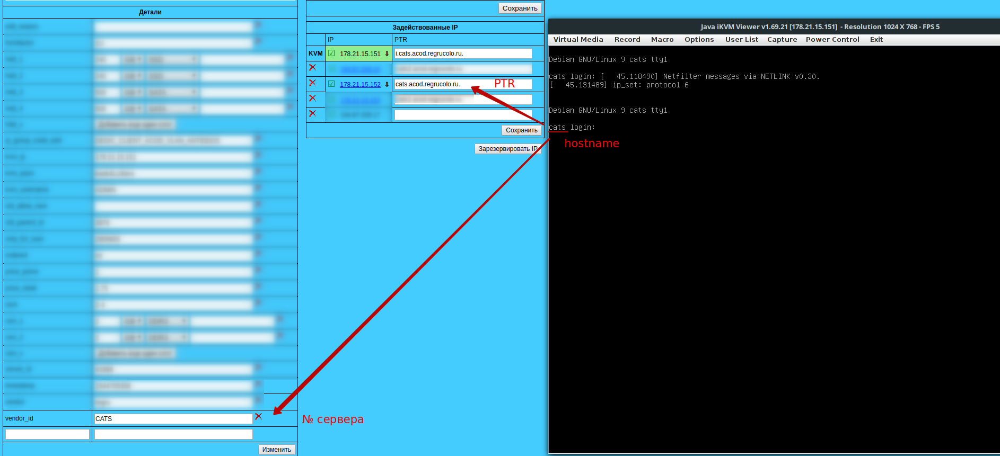
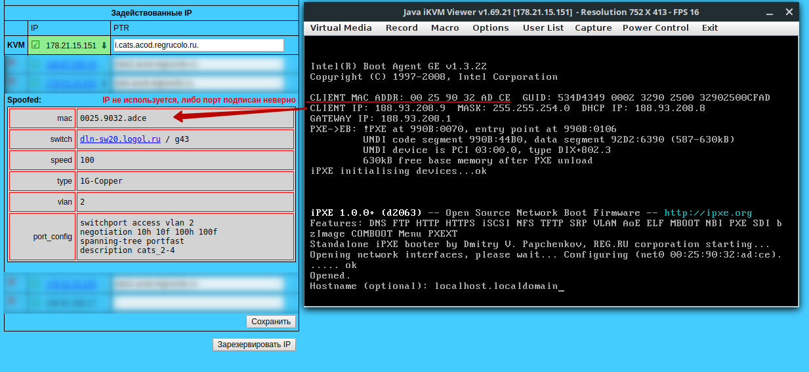
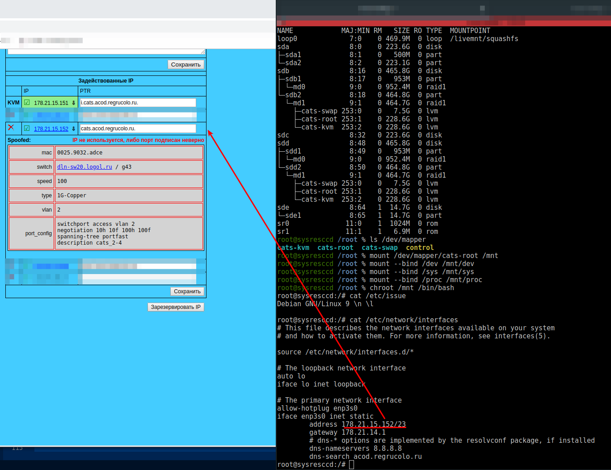

## Установка рекомендуемых настроек BIOS

Загружаемся в BIOS и устанавливаем рекомендуемые настройки.

1. Раздел Advanced:
* Boot Feature / Quiet Boot / установить **Disable**.
* PCIe/PCI/PnP / Load Onboard LAN 1 (2) Option Rom / установить **Enabled**.
* Super IO Configuration / 
  - COM1 (COM0) установить **Enabled**, **Auto** или **Default**.
  - COM2 (COM1) установить **SOL**. Если нет выбора **SOL**, то установить **Enabled**.
* Serial Port Console Redirection / 
  - COM1 / Console Redirection / установить **Disabled**.
  - COM2/SOL / Console Redirection / установить **Enabled**.
  - SOL /
    - Console Redirection / установить **Enabled**.
    - Console Resirections settings:
      - Bits per seconds / установить **115200**.
       - Legacy OS Redirection Resolution / установить **80 X 25**.
       - Redirection After BIOS POST / установить **Always Enable**,
2. Раздел Boot:
* Boot Mode / установить Legacy (выключить UEFI).
* Order option priorities:
  1. Установить **USB CDROM**. Если такого пункта нет, то установить CDROM.
  2. Установить первый системный диск или аппаратный RAID-контроллер.
  3. Второй системный диск, если нет аппаратного RAID-контроллера.
  4. Загрузка по сети.

## Идентификация сервера

Перед тем, как выполнять очистку дисков, необходимо убедиться, что мы зашли на нужный сервер. Выполнить проверку можно одним из следующих способов:
1. По *hostname* сервера.
Если клиент не изменил hostname сервера после установки операционной системы Linux, которая была произведена специалистами ТПК, то hostname должен совпадать с номером сервера и PTR записью в менеджере.  
.
2. По MAC-адресу сетевой карты сервера.
При выборе приоритета загрузки по сети (PXE) будет указан MAC-адрес устройства. Данный MAC-адрес должен совпадать с MAC-адресом, указанным в менеджере.

3. Проверить IP адрес, используемый на сервере на соответствие с IP адресом в менеджере.
Загрузившить с любого образа rescueCD необходимо выплнить chroot в корень системы. Способ выполнения изменения корневого каталога файловой системы описан в статье [Восстановление работоспособности системы Linux после переноса дисков в подменную платформу](https://cloud-core.ru/kb/vosstanovlenie-rabotosposobnosti-sistemy-linux-posle-perenosa-diskov-v-podmennuju-platformu).
В нашем случае выполняем следующие команды.
Просматриваем где находится / командой `lsblk`.
```sh
lsblk
AME            MAJ:MIN RM   SIZE RO TYPE  MOUNTPOINT
loop0             7:0    0 469.9M  0 loop  /livemnt/squashfs
sda               8:0    0 223.6G  0 disk  
├─sda1            8:1    0   500M  0 part  
└─sda2            8:2    0 223.1G  0 part  
sdb               8:16   0 465.8G  0 disk  
├─sdb1            8:17   0   953M  0 part  
│ └─md0           9:0    0 952.4M  0 raid1 
└─sdb2            8:18   0 464.8G  0 part  
  └─md1           9:1    0 464.7G  0 raid1 
    ├─cats-swap 253:0    0   7.5G  0 lvm   
    ├─cats-root 253:1    0 228.6G  0 lvm   
    └─cats-kvm  253:2    0 228.6G  0 lvm   
sdc               8:32   0 223.6G  0 disk  
sdd               8:48   0 465.8G  0 disk  
├─sdd1            8:49   0   953M  0 part  
│ └─md0           9:0    0 952.4M  0 raid1 
└─sdd2            8:50   0 464.8G  0 part  
  └─md1           9:1    0 464.7G  0 raid1 
    ├─cats-swap 253:0    0   7.5G  0 lvm   
    ├─cats-root 253:1    0 228.6G  0 lvm   
    └─cats-kvm  253:2    0 228.6G  0 lvm   
sde               8:64   1  14.7G  0 disk  
└─sde1            8:65   1  14.7G  0 part  
sr0              11:0    1  1024M  0 rom   
sr1              11:1    1   6.9M  0 rom   
```
Как видно, / находится в LV группе.
```sh
ls /dev/mapper 
cats-kvm  cats-root  cats-swap  control
```
Монтируем системные каталоги:
```sh
mount /dev/mapper/cats-root /mnt 
mount --bind /dev /mnt/dev
mount --bind /sys /mnt/sys
mount --bind /proc /mnt/proc
```
Меняем корневой каталог:
```sh
chroot /mnt /bin/bash
```
После изменения корневого каталога просматриваем, какой дистрибутив установлен в системе командой `cat /etc/issue` или `cat /etc/*-release`.
```sh
cat /etc/issue
Debian GNU/Linux 9 \n \l
```
Как видно, в системе установлен Debian 9. В Debiant сетевые настройки интерфейсов находятся в файле /etc/network/interfaces или в директории /etc/network/interfaces.d/*.
Просмотрим файл /etc/network/interfaces
```sh
cat /etc/network/interfaces
 # This file describes the network interfaces available on your system
 # and how to activate them. For more information, see interfaces(5).
 
 source /etc/network/interfaces.d/*

 # The loopback network interface
 auto lo
 iface lo inet loopback
 
 # The primary network interface
 allow-hotplug enp3s0
 iface enp3s0 inet static
     address 178.21.15.152/23
	 gateway 178.21.14.1
	 # dns-* options are implemented by the resolvconf package, if installed
	 dns-nameservers 8.8.8.8
	 dns-search acod.regrucolo.ru
```
В данном случае IP адрес 178.21.15.152 на сетевом интерфейсе совпадает с IP адресом в менеджере, что говорит о том, что мы зашли на правильный сервер.


## Удаление данных

После того, как мы убедились, что зашли на правильный сервер, загружаемся с образа rescueCD iPXE и выполняем следующие действия.
1. Проверяем диски.
Проверяем наличие ошибок чтения/записи в dmesg по всем дискам.
```sh
dmesg | grep sdX
```
где sdX - наименование диска.
При анализе вывода команды обращаем внимание на DMA READ ERROR.
2. Проверяем наличие LVM.
Проверяем наличие LV-групп и, если они есть, то активируем группу.
```sh
vgchange -an
```
В результате выполнения данной команды получим наименование LV-группы, которая была активирована. Если ни одной LV-группы нет в системе, то переходим к шагу 3 данного раздела.
Удаляем все тома и группу:
```sh
vgremove -f <наименование LV-группы, полученное из предыдущей команды>
```
В результате получим сообщение, что LV-группа и её тома были удалены.
3. Проверка наличия программного RAID-массива.
Проверяем собран ли в системе программный RAID-массив.
```sh
cat /proc/mdstat
```
Результатов вывода данной команды получим информацию о программном RAID-массиве и его состоянии. Если массива нет, то переходим к шагу 4.
Чтобы остановить массив выполняем следующую команду
```sh
mdadm --manage --stop /dev/mdX
```
где mdX - наименование массива.
Чтобы остановить все имеющиеся массивы необходимо выполнить команду:
```sh
for i in $(ls -1 /dev/ | grep -e '^md' | tail -n +2); do mdadm --manage --stop /dev/$i; done
```
4. Удаляем файловую систему на дисках.
Выполняем команду для удаления файловой системы на диске:
```sh
wipefs -a /dev/sdX
```
где sdX - наименование диска.
Чтобы файловую системы на всех дисках, выполняем следующую команду:
```sh
for i in $(ls -1 /dev/ | grep -e '^sd[a-z]$'); do wipefs -a /dev/$i | tail -1 | awk '{print $1, $NF}'; done
```

**Частные случае при удалении файловой системы**
* Если разделы устройства определены, как dm-X (device mapper), то выполнить удаление всех устройств можно командой:
  ```sh
  dmsetup remove_all
  ```
  После этого выполняем удаление файловой системы.

* Если после удаления файловой системы при проверке структуры файловой системы командой `lsblk` некоторые разделы не были удалены, то можно разрушить существующую таблицу разделов командой:
  ```sh
  sgdisk --zap-all /dev/sda
  ```
* Если на сервере используется аппаратный RAID-контроллер, то необходимо загрузиться в него из BIOS и разобрать массив(ы). Разобрать массив также возможно из консоли rescueCD утилитой для работы с контроллером.
5. Сбор инвентаризации по серверу
Выполняем команду `dmiparser` и получаем сбор инвентаризации:
```sh
dmiparser
MB: Supermicro X11SSE-F, SN: ZM17AS012856
BIOS released 06/10/2017, version: 2.0a, revision: 5.11
CPU:
Intel(R) Xeon(R) CPU E3-1270 v6 @ 3.80GHz, 4 cores, Other
Memory:
DIMMA1: DDR4, Synchronous, Micron (SN: 181E7174, PN: 18ADF2G72AZ-2G6H1R) Size: 16384 MB
DIMMB1: DDR4, Synchronous, Micron (SN: 14A58F86, PN: 18ADF2G72AZ-2G3B1) Size: 16384 MB
2 free slots.
Disks:
sda 	447.1G  ATA         	INTEL SSDSC2KB48        PHYS72800046480BGN
sdb 	447.1G  ATA         	INTEL SSDSC2KB48        PHYS7280003E480BGN
IPMI: 1.28, Supermicro, 176.99.14.35
```
Данную информацию копируем и вставляем в заметку к тикету с отказом сервера.

## Проверка IPMI
Проверяем работу IPMI. Если IPMI работает, то удаляем пользователя OPERATOR. Если не работает, то пытаемся настроить IPMI согласно инструкции [Настройка IPMI](https://cloud-core.ru/kb/nastroika-ipmi)

**После всех выполненных действий, запускаем проверку оперативной памяти с образа memtest iPXE и передаем тикет в hosting-cloud::colo-vip с заметкой, в которой указываем инвентаризацию и работу IPMI**.

## Источники
[Инструкция по удалению сервера (delete)](https://docs.google.com/document/d/19WyDhLrJMSax6OrEC8_LT42YsJSC1RdnDFTqR0KLkz0/edit?pli=1#heading=h.lsdo582ryman)