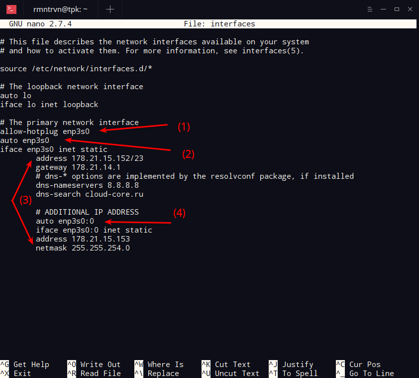

*В данной статье рассмотрена установка дополнительного IP на сетевой интерфейс сервера с использованием Linux-like операционных систем, на примере CentOS 7 / Debian*
## Установка в CentOS (REDHAT-base)
Проверим какие сетевые интерфейсы используются на сервере и какие имена они имеют, выполнив команду `ip a` (также можно использовать `ifconfig`). 
```sh
ip a
1: lo: <LOOPBACK,UP,LOWER_UP> mtu 65536 qdisc noqueue state UNKNOWN group default qlen 1000
    link/loopback 00:00:00:00:00:00 brd 00:00:00:00:00:00
    inet 127.0.0.1/8 scope host lo
       valid_lft forever preferred_lft forever
    inet6 ::1/128 scope host 
       valid_lft forever preferred_lft forever
2: enp1s0f0: <BROADCAST,MULTICAST,UP,LOWER_UP> mtu 1500 qdisc mq state UP group default qlen 1000
    link/ether 00:25:90:e0:95:10 brd ff:ff:ff:ff:ff:ff
    inet 194.58.88.98/24 brd 194.58.88.255 scope global noprefixroute enp1s0f0
       valid_lft forever preferred_lft forever
    inet6 fe80::225:90ff:fee0:9510/64 scope link 
       valid_lft forever preferred_lft forever
3: enp1s0f1: <NO-CARRIER,BROADCAST,MULTICAST,UP> mtu 1500 qdisc mq state DOWN group default qlen 1000
    link/ether 00:25:90:e0:95:11 brd ff:ff:ff:ff:ff:ff
    inet 192.168.0.2/24 brd 192.168.0.255 scope global noprefixroute enp1s0f1
       valid_lft forever preferred_lft forever
    inet6 fe80::936:7253:b5dd:c6ff/64 scope link tentative 
       valid_lft forever preferred_lft forever
```
Из данного вывода команды видно, что используются интерфейсы с именами `enp1s0f0` и `enp1s0f1`, `lo` является [Loopback](https://ru.wikipedia.org/wiki/Loopback) интерфейсом. Интерфейс `enp1s0f0` находится в состоянии *UP*, к нему прикреплён IP адрес 194.58.88.98 и является LAN 1 интерфейсом, `enp1s0f1` - LAN 2 интерфейс и находится в состояние *DOWN*.
Необходимо выполнить настройку дополнительных IP адресов на интерфейсе `enp1s0f0`. Для этого необходимо создать саб-интерфейсы. Сетевые настройки в CentOS находятся в директории `/etc/sysconfig/network-scripts/`
Переходим в директорию:
```sh
cd /etc/sysconfig/network-scripts/
```
В данной директории уже есть конфигурационные файлы интерфейсов. 
```sh
ls -lha *enp1s0f*
-rw-r--r-- 1 root root 153 авг  4 12:41 ifcfg-enp1s0f0
-rw-r--r-- 1 root root 329 авг  5 09:27 ifcfg-enp1s0f1
```
Теперь необходимо создать файл подынтерфейса для IP адреса. Создадим файл подынтерфейса для `enp1s0f0`.
```sh
touch ifcfg-enp1s0f0:0
```
Откроем созданный файл в текстовом редакторе.
```
vim ifcfg-enp1s0f0:0
```
Добавим в него информацию о дополнительном IP адресе:
```
DEVICE=enp1s0f0:0
BOOTPROTO=static
ONBOOT=yes
IPADDR=194.58.45.13
NETMASK=255.255.255.0
```
Строка `DEVICE=enp1s0f0:0` указывает на название подынтерфейса, `BOOTPROTO=static` -- подключение статических настроек, `ONBOOT=yes` -- загрузка конфигурационного файла при загрузке ОС, `IPADDR=194.58.45.13` -- IP адрес, выданный при заказе услуги, `NETMASK=255.255.255.0` -- маска подсети, выданная при заказе услуги.
>В случае заказа нескольких дополнительных IP-адресов, необходимо менять индекс сетевого интерфейса (`enp1s0f0:1`, `enp1s0f0:2` и т.д.) Если необходимо добавить еще один IP адрес на интерфейс сервера, то необходимо создать еще один файл подынтерфейса -- `ifcfg-enp1s0f0:1`.

Далее будем использовать команду `echo` для быстрого создания файлов подынтерфейсов:
```sh
echo -e "DEVICE=enp1s0f0:0 \nBOOTPROTO=static \nONBOOT=yes \nIPADDR=194.58.45.14 \nNETMASK=255.255.255.0" > /etc/sysconfig/network-scripts/ifcfg-enp1s0f0:1
```
После того, как файлы сконфигурированы необходимо выполнить перезагрузку сетевого интерфейса:
```sh
systemctl stop network;systemctl start network
```
Либо, командой:
```
/etc/init.d/network restart
```
Проверяем пинг к IP адресу:
```sh
ping -c 4 194.58.45.13
PING 194.58.45.13 (194.58.45.13) 56(84) bytes of data.
64 bytes from 194.58.45.13: icmp_seq=1 ttl=55 time=14.1 ms
64 bytes from 194.58.45.13: icmp_seq=2 ttl=55 time=14.2 ms
64 bytes from 194.58.45.13: icmp_seq=3 ttl=55 time=14.1 ms
64 bytes from 194.58.45.13: icmp_seq=4 ttl=55 time=14.2 ms

--- 194.58.45.13 ping statistics ---
4 packets transmitted, 4 received, 0% packet loss, time 3003ms
rtt min/avg/max/mdev = 14.141/14.190/14.245/0.125 ms
```
## Установка в Debian (Debian-base)
Установка в Debian-base операционных системах Linux аналогично за исключением некоторых нюансов. Сначала смотрим используемые интерфейсы сервера:
```sh
ifconfig
enp3s0: flags=4163<UP,BROADCAST,RUNNING,MULTICAST>  mtu 1500
        inet 178.21.15.152  netmask 255.255.254.0  broadcast 178.21.15.255
        inet6 fe80::225:90ff:fe32:adce  prefixlen 64  scopeid 0x20<link>
        ether 00:25:90:32:ad:ce  txqueuelen 1000  (Ethernet)
        RX packets 7301090  bytes 852905408 (813.3 MiB)
        RX errors 0  dropped 30896  overruns 0  frame 0
        TX packets 154380  bytes 22019135 (20.9 MiB)
        TX errors 0  dropped 0 overruns 0  carrier 0  collisions 0
        device interrupt 16  memory 0xfb5e0000-fb600000  

lo: flags=73<UP,LOOPBACK,RUNNING>  mtu 65536
        inet 127.0.0.1  netmask 255.0.0.0
        inet6 ::1  prefixlen 128  scopeid 0x10<host>
        loop  txqueuelen 1  (Local Loopback)
        RX packets 8  bytes 378 (378.0 B)
        RX errors 0  dropped 0  overruns 0  frame 0
        TX packets 8  bytes 378 (378.0 B)
        TX errors 0  dropped 0 overruns 0  carrier 0  collisions 0
```
В данном случае используемое имя сетевого интерфейса `enp3s0`. Сетевые настройки в Debian-based OS находятся в директории `/etc/network/interfaces`. Перейдём в редактирование сетевых настроек (nano, vi):
```
nano /etc/network/interfaces
```
Файл конфигурации сети уже имеет настройки для сетевого интерфейса. 
```
# This file describes the network interfaces available on your system
# and how to activate them. For more information, see interfaces(5).

source /etc/network/interfaces.d/*

# The loopback network interface
auto lo
iface lo inet loopback

# The primary network interface
allow-hotplug enp3s0
iface enp3s0 inet static
        address 178.21.15.152/23
        gateway 178.21.14.1
        # dns-* options are implemented by the resolvconf package, if installed
        dns-nameservers 8.8.8.8
        dns-search cloud-core.ru
```
Добавим в него информацию о дополнительном IP адресе:
```
auto enp3s0:0
        iface enp3s0:0 inet static
        address 178.21.15.153
        netmask 255.255.254.0
```
Итоговая запись будет выглядет, как на рисунке ниже:

(1) -- включение параметра `allow-hotplug` позволяет автоматически включать интерфейс при загрузке операционной системы;
(2) -- IP адрес. Следует обратить внимание, что маску сети позволительно записывать как в форме префикса сети (/23), так и в десятничном формате (255.255.254.0);
(3) -- `enp3s0:0` название подынтерфейса. Последующим IP адресам необходимо менять индекс подынтерфейса (`enp3s0:1`, `enp3s0:1` и т.д.).
Шлюз (`gateway`) можно записывать только один раз.
После того сделаны необходимые записи в файле сетевой конфигурации, необходимо его сохранить и перезагрузить сетевую карту:
```sh
/etc/init.d/networking restart
```
Или перезагрузить интерфейс:
```sh
ifdown enp3s0 && ifup enp3s0
```
Бывают ситуации, когда сеть не поднимается после перезагрузки сетевой карты. В таком случае необходимо зайти на сервер, используя IPMI/KVM и включить интерфейс вручную:
```sh
ifup enp3s0
```
Либо перезагрузить сервер.
## Источники
1. [Как в Debian Linux создать два IP адреса на одном интерфейсе](https://webhamster.ru/mytetrashare/index/mtb0/1500112515gtt4ro10yq)
2. [Настройка сети в Ubuntu и CentOS](https://proft.me/2011/08/13/nastrojka-seti-v-ubuntu-i-centos/)
3. [Как настроить сетевые параметры в Debian
](https://serveradmin.ru/nastroyka-seti-v-debian/)
4. [Как подключить дополнительные IP-адреса для выделенного сервера?](https://www.reg.ru/support/hosting-i-servery/dedicated/zakaz-i-nastrojka-vydelennogo-servera/kak-podklyuchit-dopolnitelnye-ip-adresa-dlya-vydelennogo-servera)