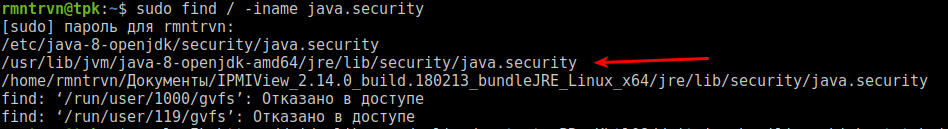

## Установка инструментов Java на локальную машину для работы с .jnlp файлами

Для работы с консолью IPMI/KVM потребуется загрузка java-файлов с расширением .jnlp. 

Для запуска файлов данного типа установим JRE.
```sh
sudo apt install default-jre
```
В результате выполнения этой команды будет установлена Java Runtime Environment (JRE). 
> Можно также установить пакет Java Development Kit (JDK) вместо этого. Он понадобится для разработки специфического ПО или используется для компиляции программ на Java. JDK включает JRE, поэтому вы можете выбрать этот метод установки.
>```sh
>sudo apt-get install default-jdk
>```
>Пакеты open JRE и open JDK есть в репозиториях многих дистрибутивов Linux.

Проверяем версию Java:
```sh
java -version

openjdk version "1.8.0_181"
OpenJDK Runtime Environment (build 1.8.0_181-8u181-b13-1~deb9u1-b13)
OpenJDK 64-Bit Server VM (build 25.181-b13, mixed mode)
```
Проверяем версию компилятора Java:
```
javac -version

javac 1.8.0_181
```
Далее установим последнюю версию плагина IcedTea (Web Start) для web-браузера:
```sh
sudo apt-get install icedtea-plugin
```
Проверить версию Java Web Start можно следующей командой:
```
javaws --version

icedtea-web 1.6.2 (1.6.2-3.1)
```

Если необходима версия Java от Oracle, то возможно установить версию по следующей инструкции: [How To Install Java with Apt-Get on Debian 8](https://www.digitalocean.com/community/tutorials/how-to-install-java-with-apt-get-on-debian-8)

## Решение проблы с алгоритмами шифрования
Необходимо найти файл `<javahomedir>/lib/security/java.security` с библиотекой алгоритма шифрования:
```sh
sudo find / -iname java.security
```

Открываем найденный файл в текстовом редакторе (vim или nano) :
```sh
sudo nano /usr/lib/jvm/java-8-openjdk-amd64/jre/lib/security/java.security
```
Далее необходимо закомментировать `#` или удалить строки, отвечающие за использование алгоритмов шифрования:
```
jdk.certpath.disabledAlgorithms=MD2, MD5, RSA keySize < 1024
```

и
```
jdk.jar.disabledAlgorithms=MD2, MD5, RSA keySize < 1024, DSA keySize < 1024
```

Выходим из редактора и сохраняем файл.

>При использовании Oracle Java, возможно указать `file:/` в списке допустимых сайтов без проверки безопасности. Тогда все используемые .jnlp файлы будут открываться без проверки безопасности. Отключение использования алгоритмов шифрования при использовании Oracle Java также необходимо выполнять по инструкции написанной выше.

## Источники:
1. [Java](https://help.ubuntu.ru/wiki/java)
2. [Java jnlp application blocked by Security settings](https://stackoverflow.com/questions/20967995/java-jnlp-application-blocked-by-security-settings)
3. [Предупреждение системы безопасности Java](https://kb.justhost.ru/article/375)
4. [УСТАНОВКА JAVA В DEBIAN 8](https://www.8host.com/blog/ustanovka-java-v-debian-8/)
5. [How To Install Java with Apt-Get on Debian 8](https://www.digitalocean.com/community/tutorials/how-to-install-java-with-apt-get-on-debian-8)