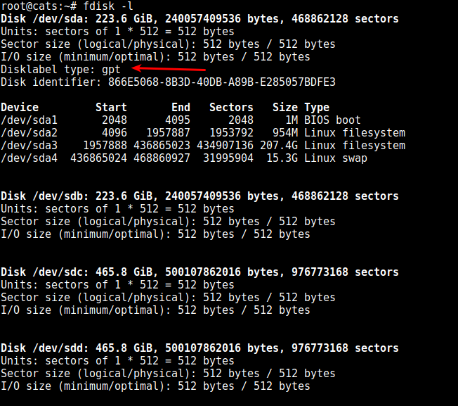
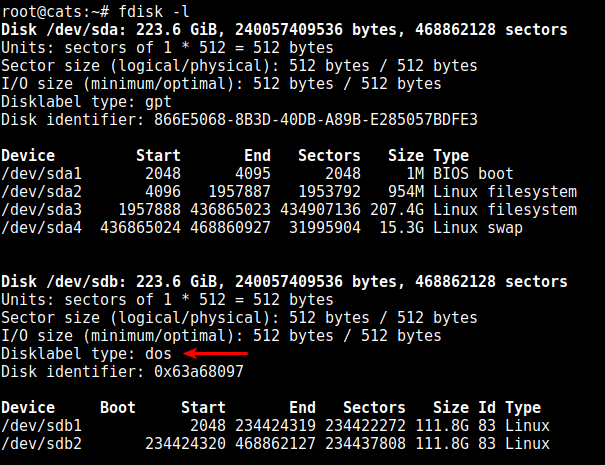

*В данной статье будет рассмотрено монтирование разделов в файловую систему Linux, а также запись информации о разделе в fstab*
Рассмотрим сервер, в котором используется следующая дисковая конфигурация:
2 X 240 GB SSD
2 X 500 GB SATA
Система Linux установлена на первый SSD диск sda:
```sh
root@cats:~# lsblk
NAME   MAJ:MIN RM   SIZE RO TYPE MOUNTPOINT
sda      8:0    0 223.6G  0 disk 
├─sda1   8:1    0     1M  0 part 
├─sda2   8:2    0   954M  0 part /boot
├─sda3   8:3    0 207.4G  0 part /
└─sda4   8:4    0  15.3G  0 part [SWAP]
sdb      8:16   0 223.6G  0 disk 
sdc      8:32   0 465.8G  0 disk 
sdd      8:48   0 465.8G  0 disk  
```
## Техническое задание
Необходимо создать разделы на диске sdb и примонтировать к существующей файловой системе. Из дисков sdc и sdd необходходимо создать программный RAID-1 массив и примонтировать к существующей файловой системе. Итоговое техническое задание представлено в следующей таблице:

|    Диски    | Обозначение дисков в Linux |    Разделы   | Таблица разделов | Точка монтирования |
|:-----------:|:--------------------------:|:------------:|:----------------:|--------------------|
|  240 GB SSD |             sda            |   sda2 sda3  |     MBR (DOS)    | /, swap             |
|  240 GB SSD |             sdb            |  sdb1  sdb2  |     MBR (DOS)    | /data1, /data2     |
| 500 GB SATA |             sdc            | sdc1 - RAID1 |        GPT       | /storage           |
| 500 GB SATA |             sdd            | sdd1 - RAID1 |        GPT       | /storage           |

### Создание разделов
Проверяем наличие существующих разделов и используемых на них таблиц: 
```sh
fdisk -l
```

Из предоставленного вывода видно, что на диске sda используется таблица разделов [GPT](https://ru.wikipedia.org/wiki/%D0%A2%D0%B0%D0%B1%D0%BB%D0%B8%D1%86%D0%B0_%D1%80%D0%B0%D0%B7%D0%B4%D0%B5%D0%BB%D0%BE%D0%B2_GUID). На диске sdb имеется 223.6 GB дискового пространства. Создадим разделы sdb1 и sdb2 на диске sdb, используя таблицу разделов [MBR](https://wiki.archlinux.org/index.php/Master_Boot_Record_(%D0%A0%D1%83%D1%81%D1%81%D0%BA%D0%B8%D0%B9)):
```sh
fdisk /dev/sdb
```
Список доступных команд можно получить введя `m`:
```sh
Welcome to fdisk (util-linux 2.29.2).
Changes will remain in memory only, until you decide to write them.
Be careful before using the write command.

Device does not contain a recognized partition table.
Created a new DOS disklabel with disk identifier 0x63a68097.

Command (m for help): m

Help:

  DOS (MBR)
   a   toggle a bootable flag
   b   edit nested BSD disklabel
   c   toggle the dos compatibility flag

  Generic
   d   delete a partition
   F   list free unpartitioned space
   l   list known partition types
   n   add a new partition
   p   print the partition table
   t   change a partition type
   v   verify the partition table
   i   print information about a partition

  Misc
   m   print this menu
   u   change display/entry units
   x   extra functionality (experts only)

  Script
   I   load disk layout from sfdisk script file
   O   dump disk layout to sfdisk script file

  Save & Exit
   w   write table to disk and exit
   q   quit without saving changes

  Create a new label
   g   create a new empty GPT partition table
   G   create a new empty SGI (IRIX) partition table
   o   create a new empty DOS partition table
   s   create a new empty Sun partition table

Command (m for help): 
```
! Очередность создания разделов имеет значение. Чем ближе раздел к началу диска — тем больше скорость считывания, из-за скорости вращения.
Далее создаём раздел с помощью опции `n`. При выборе типа указывает основаной (primary) - опция `p`, номер раздела (Partition number) указываем `1`, первый сектор (First sector) `2048`, последний сектор (Last Sector) `+111.8G`, т.к. необходимо разделить диск sdb на 2 равных раздела sdb1 и sdb2, то 223.6 GB / 2 = 111.8G.
```sh
Command (m for help): n
Partition type
   p   primary (0 primary, 0 extended, 4 free)
   e   extended (container for logical partitions)
Select (default p): p
Partition number (1-4, default 1): 1
First sector (2048-468862127, default 2048): 
Last sector, +sectors or +size{K,M,G,T,P} (2048-468862127, default 468862127): +111.8G

Created a new partition 1 of type 'Linux' and of size 111.8 GiB.
```
Аналогично создаём второй раздел.
Для создания раздела выбираем опцию `n`, тип раздела основной (Primary) - опция `p`, номер раздела - `2`, первый сектор и последний сектор оставляем по умолчанию, т.к. данный раздел будет занимать все оставшееся место на диске - нажимаем два раза **Enter**. Проверяем созданные разделы с помощью опции `p`.
```sh
Command (m for help): n
Partition type
   p   primary (1 primary, 0 extended, 3 free)
   e   extended (container for logical partitions)
Select (default p): p
Partition number (2-4, default 2): 2
First sector (234424320-468862127, default 234424320): 
Last sector, +sectors or +size{K,M,G,T,P} (234424320-468862127, default 468862127): 

Created a new partition 2 of type 'Linux' and of size 111.8 GiB.

Command (m for help): p
Disk /dev/sdb: 223.6 GiB, 240057409536 bytes, 468862128 sectors
Units: sectors of 1 * 512 = 512 bytes
Sector size (logical/physical): 512 bytes / 512 bytes
I/O size (minimum/optimal): 512 bytes / 512 bytes
Disklabel type: dos
Disk identifier: 0x63a68097

Device     Boot     Start       End   Sectors   Size Id Type
/dev/sdb1            2048 234424319 234422272 111.8G 83 Linux
/dev/sdb2       234424320 468862127 234437808 111.8G 83 Linux
```
Для записи внесенных изменений вводим `w`.
```sh
Command (m for help): w
The partition table has been altered.
Calling ioctl() to re-read partition table.
Syncing disks.
```
Проверяем созданные разделы:

Как видно и рисунка выше на диске используется таблица разделов MBR (DOS).
По техническому заданию на дисках sdc и sdd должна использоваться таблица разделов GPT. Установка данной таблицы выполняется утилитой `gdisk`. Если на сервере отсутствует данная таблица, тогда выполняем её установку.
Для Debian-based OS:
```sh
apt install gdisk
```
Для CentOS:
```sh
yum install gdisk
```
Создадим раздел на диске sdc с помощью утилиты `gparted`:
```sh
gdisk /dev/sdc
```
Для просмотра всех опций утилиты вводим `?`.
```sh
GPT fdisk (gdisk) version 1.0.1

Partition table scan:
  MBR: not present
  BSD: not present
  APM: not present
  GPT: not present

Creating new GPT entries.

Command (? for help): ?
b	back up GPT data to a file
c	change a partition's name
d	delete a partition
i	show detailed information on a partition
l	list known partition types
n	add a new partition
o	create a new empty GUID partition table (GPT)
p	print the partition table
q	quit without saving changes
r	recovery and transformation options (experts only)
s	sort partitions
t	change a partition's type code
v	verify disk
w	write table to disk and exit
x	extra functionality (experts only)
?	print this menu
```
Чтобы создать раздел выбираем опцию `n`.

Номер раздела устанавливаем, например, `1`, первый и последний сектор установаливаем значения по умолчанию, т.к. весь диск будет иметь только один раздел sdc1 - нажимаем 2 разад **Enter**, HEX код устанавливаем также по-умолчанию.
Для записи изменения также выбираем опцию `w`.
```sh
Command (? for help): n
Partition number (1-128, default 1): 1
First sector (34-976773134, default = 2048) or {+-}size{KMGTP}: 
Last sector (2048-976773134, default = 976773134) or {+-}size{KMGTP}: 
Current type is 'Linux filesystem'
Hex code or GUID (L to show codes, Enter = 8300): 
Changed type of partition to 'Linux filesystem'

Command (? for help): w

Final checks complete. About to write GPT data. THIS WILL OVERWRITE EXISTING
PARTITIONS!!

Do you want to proceed? (Y/N): Y
OK; writing new GUID partition table (GPT) to /dev/sdc.
The operation has completed successfully.
```
Повторяем действия по созданию таблицу GPT и раздела для sdd диска. Проверяем корректность выполненных действий:
```sh
fdisk -l
Disk /dev/sda: 223.6 GiB, 240057409536 bytes, 468862128 sectors
Units: sectors of 1 * 512 = 512 bytes
Sector size (logical/physical): 512 bytes / 512 bytes
I/O size (minimum/optimal): 512 bytes / 512 bytes
Disklabel type: gpt
Disk identifier: 866E5068-8B3D-40DB-A89B-E285057BDFE3

Device         Start       End   Sectors   Size Type
/dev/sda1       2048      4095      2048     1M BIOS boot
/dev/sda2       4096   1957887   1953792   954M Linux filesystem
/dev/sda3    1957888 436865023 434907136 207.4G Linux filesystem
/dev/sda4  436865024 468860927  31995904  15.3G Linux swap


Disk /dev/sdb: 223.6 GiB, 240057409536 bytes, 468862128 sectors
Units: sectors of 1 * 512 = 512 bytes
Sector size (logical/physical): 512 bytes / 512 bytes
I/O size (minimum/optimal): 512 bytes / 512 bytes
Disklabel type: dos
Disk identifier: 0x63a68097

Device     Boot     Start       End   Sectors   Size Id Type
/dev/sdb1            2048 234424319 234422272 111.8G 83 Linux
/dev/sdb2       234424320 468862127 234437808 111.8G 83 Linux


Disk /dev/sdc: 465.8 GiB, 500107862016 bytes, 976773168 sectors
Units: sectors of 1 * 512 = 512 bytes
Sector size (logical/physical): 512 bytes / 512 bytes
I/O size (minimum/optimal): 512 bytes / 512 bytes
Disklabel type: gpt
Disk identifier: 2855835C-A61F-4E1E-B49A-552BBAF6F9A0

Device     Start       End   Sectors   Size Type
/dev/sdc1   2048 976773134 976771087 465.8G Linux filesystem


Disk /dev/sdd: 465.8 GiB, 500107862016 bytes, 976773168 sectors
Units: sectors of 1 * 512 = 512 bytes
Sector size (logical/physical): 512 bytes / 512 bytes
I/O size (minimum/optimal): 512 bytes / 512 bytes
Disklabel type: gpt
Disk identifier: 83F5CF7F-D844-4973-8ED0-BC9EA3F6CAB5

Device     Start       End   Sectors   Size Type
/dev/sdd1   2048 976773134 976771087 465.8G Linux filesystem
```
Создадим программный RAID-1 из разделов sdc1 и sdd1 используя утилиту `mdadm`:
```sh
mdadm --create --verbose /dev/md0 --level=1 --raid-devices=2 /dev/sdc1 /dev/sdd1
```
Соглашаемся с созданием массива и после этого будет запущена синхронизация массива. Посмотреть прогресс синхронизации возможно следующей командой:
```sh
cat /proc/mdstat
Personalities : [raid1] 
md0 : active raid1 sdd1[1] sdc1[0]
      488254464 blocks super 1.2 [2/2] [UU]
      [=>...................]  resync =  7.5% (37102464/488254464) finish=64.3min speed=116864K/sec
      bitmap: 4/4 pages [16KB], 65536KB chunk

unused devices: <none>
```
>Более подробно о программном RAID-массиве в Linux рассмотрено в статье [Программный RAID в Linux (mdadm)](https://cloud-core.ru/kb/programmnyj-raid-na-linux)

Проверяем разметку дисков командой:
```sh
lsblk
```

Как видно для программного RAID-массива создан раздел md0. После того, как синхронизация завершится необходимо добавить информацию о RAID-массиве. Если файл конфигурации `mdadm.conf` отсутсвует, то необходимо его создать.
```sh
echo "DEVICE partitions" > /etc/mdadm/mdadm.conf
```
Далее необходимо добавить в него информацию о RAID-массиве:
```sh
mdadm --detail --scan --verbose | awk '/ARRAY/ {print}' >> /etc/mdadm/mdadm.conf
```
```sh
update-initramfs -u
```
После этого переходим к следующему шагу.

### Создание файловой системы
Создадим файловую систему ext4 для раздела sdb1:
```sh
mkfs -t ext4 /dev/sdb1
```
! Расширенный раздел не может быть отформатирован с файловыми системами, такими как ext3, FAT или NTFS, и не может непосредственно содержать данные.
Создадим файловую систему ext4 для раздела sdb2:
```sh
mkfs -t ext4 /dev/sdb2
```
Создадим файловую систему ext4 для раздела md0:
```sh
mkfs -t ext4 /dev/md0
```
При создании файловой системы etx4 на разделе RAID-массива система уведомит, что файловая система уже существует, т.к. при создании массива была автоматически создана файловая система.
! Для создания FAT32 можно воспользоваться такой командой:
! ```sh
! mkfs -t vfat /dev/sdXN
! ```
! Где X - буква диска, N - номер раздела.
! В Debian-based OS, чтобы было доступно создание файловых систем FAT и FAT32 требуется установить пакет dosfstools.

### Монтирование разделов
Создадим точки монтирования согласно техническому заданию.
Создадим точку монтирования /data1
```sh
mkdir /data1
```
! Обычно точка монтирования создается в директориях /mnt или /media. Для расширенного раздела точку монтирования создавать не нужно.
Создадим точку монтирования /data2
```sh
mkdir /data2
```
Создадим точку монтирования /storage
```sh
mkdir /storage
```
Изменим режим доступа к разделам:
```sh
chmod -R 660 /data1
chmod -R 660 /data2
chmod -R 660 /storage
```
Для монтирования в Linux используется команда `mount`. В общем случае для монтирования разделов используется следующая команда и её опции:
```sh
mount <файл_устройства> <папка_назначения>
```
Расширенный вариант набора опций `mount`:
```sh
mount <опции> -t файловая_система -o <опции_монтирования> <файл_устройства> <папка_назначения>
```
Основные опции:
`-V` — вывести версию утилиты;
`-h` — вывести справку;
`-v` — подробный режим;
`-a`, `--all` — примонтировать все устройства, описанные в fstab;
`-F`, `--fork` — создавать отдельный экземпляр mount для каждого отдельного раздела;
`-f`, `—fake` — не выполнять никаких действий, а только посмотреть что собирается делать утилита;
`-n`, `--no-mtab` — не записывать данные о монтировании в /etc/mtab;
`-l`, `--show-labels` — добавить метку диска к точке монтирования;
`-c` — использовать только абсолютные пути;
`-r`, `--read-only` — монтировать раздел только для чтения;
`-w`, `--rw` — монтировать для чтения и записи;
`-L`, `--label` — монтировать раздел по метке;
`-U`, `--uuid` — монтировать раздел по UUID;
`-T`, `--fstab` — использовать альтернативный fstab;
`-B`, `--bind` — монтировать локальную папку;
`-R`, `--rbind` — перемонтировать локальную папку.
Выполним монтирование /data1 и /data2 согласно техническому заданию.
```sh
mount /dev/sdb1 /data1
mount /dev/sdb2 /data2
```
Выполним монтирование /storage согласно техническому заданию.
```sh
mount /dev/md0 /storage
```
Проверяем корректность выполненного монтирования командой `lsblk`.
```sh
root@cats:~# lsblk
NAME    MAJ:MIN RM   SIZE RO TYPE  MOUNTPOINT
sda       8:0    0 223.6G  0 disk  
├─sda1    8:1    0     1M  0 part  
├─sda2    8:2    0   954M  0 part  /boot
├─sda3    8:3    0 207.4G  0 part  /
└─sda4    8:4    0  15.3G  0 part  [SWAP]
sdb       8:16   0 223.6G  0 disk  
├─sdb1    8:17   0 111.8G  0 part  /data1
└─sdb2    8:18   0 111.8G  0 part  /data2
sdc       8:32   0 465.8G  0 disk  
└─sdc1    8:33   0 465.8G  0 part  
  └─md0   9:0    0 465.7G  0 raid1 /storage
sdd       8:48   0 465.8G  0 disk  
└─sdd1    8:49   0 465.8G  0 part  
  └─md0   9:0    0 465.7G  0 raid1 /storage
```
Как видим разделы успешно смонтированы.

### Запись в файл fstab
Для автоматического монтирования разделов после перезагрузки сервера необходимо внести изменения в файл /etc/fstab. Каждая запись имеет следующие поля, которые разделяются пробелом или табуляцией:
```
<device-spec>	<mount-point>	<fs-type>	<options>	<dump>	<pass>
```
* Поле, `<device-spec>` (устройство) сообщает демону монтирования файловых систем `mount`, что монтировать, имя монтируемого устройства или его метку.
* Второе поле, `<mount-point>` (точка монтирования), определяет путь, по которому будет смонтировано устройство `<device-spec>`.
Поле `<fs-type>` (тип файловой системы) содержит тип файловой системы монтируемого устройства. 
* `<options>` Параметры монтирования файловой системы. Подробнее в [
FILESYSTEM-INDEPENDENT MOUNT OPTIONS](https://jlk.fjfi.cvut.cz/arch/manpages/man/mount.8#FILESYSTEM-INDEPENDENT_MOUNT_OPTIONS). Некоторые параметры относятся к конкретным типам файловых систем.
* `<dump>` Используется утилитой `dump` для определения того, нужно ли создать резервную копию данных в файловой системе. Возможные значения: 0 или 1. Если указано число 1, dump создаст резервную копию. У большинства пользователей утилита dump не установлена, поэтому им следует указывать 0 в этом поле.
* `<pass>` Используется программой `fsck` для определения того, нужно ли проверять целостность файловой системы. Возможные значения: 0, 1 или 2. Значение 1 следует указывать только для корневой файловой системы (с точкой монтирования /); для остальных ФС, которые вы хотите проверять, используйте значение 2, которое имеет менее высокий приоритет.Обратите внимание, что в случае btrfs следует всегда указывать 0, даже если эта файловая система используется в качестве корневой. Файловые системы, для которых в поле указано значение 0, не будут проверяться `fsck`.

Выполнять запись `<device-spec>` можно по UUID и по наименованию раздела. Чтобы просмотреть соответствие UUID и раздела выполним следующую команду:
```sh
lsblk -f

NAME    FSTYPE  LABEL            UUID                                 MOUNTPOINT
sda                                                                   
├─sda1                                                                
├─sda2  ext2                     27e4c66b-e568-4cd0-b055-0b958beeff67 /boot
├─sda3  ext4                     639cd415-374b-4e26-a32a-c62ea6d7976f /
└─sda4  swap                     b8a20fca-fcfb-4f71-b59d-7c913613d011 [SWAP]
sdb                                                                   
├─sdb1  ext4                     fefc343a-13fd-4951-a829-e59f06693c4f /data1
└─sdb2  ext4                     bb21d70e-1b54-40bf-878f-11d7fac70d33 /data2
sdc                                                                   
└─sdc1  linux_r cats:0           60f19f21-e227-c7f2-d402-69437b6ebb38 
  └─md0 ext4                     0121abec-9a62-41bd-b5b6-1ce18d27ed33 /storage
```
! **UUID (universally unique identifier)** - являются универсальным уникальным идентификаторам, который может быть создан без использования централизованных полномочий.
Необходимо внести запись о разделах /data1, /data2 и /storage в файл в fstab. Их UUID `7f6c83e8-317d-457f-b376-88ceb19e9f73`, `b0898ef1-94a2-441b-aaee-f291a37ecb3d` и `f6e88588-8b5f-4b3f-8f8a-72fc147f6911`, соответственно.
С помощью текстового редактора, например nano, откроем файл fstab:
```sh
nano /etc/fstab
```
Заполняем требуемые поля в соответствие с выводом команды `lsblk -f` и сохраняем файл.
```sh
# /etc/fstab: static file system information.
#
# Use 'blkid' to print the universally unique identifier for a
# device; this may be used with UUID= as a more robust way to name devices
# that works even if disks are added and removed. See fstab(5).
#
# <file system> <mount point>   <type>  <options>       <dump>  <pass>
# / was on /dev/sda3 during installation
UUID=18cf709d-a4d5-4eba-90c4-5500c988b592 /               ext4    errors=remount-ro 0       1
# /boot was on /dev/sda2 during installation
UUID=ed8aa761-ac5c-4b57-b72a-3f6057470cd1 /boot           ext2    defaults        0       2
# swap was on /dev/sda4 during installation
UUID=82a6d2c5-6429-487c-85a9-040c6b83b8e4 none            swap    sw              0       0
UUID=7f6c83e8-317d-457f-b376-88ceb19e9f73 /data1 ext4 defaults 0 0
UUID=b0898ef1-94a2-441b-aaee-f291a37ecb3d /data2 ext4 defaults 0 0
UUID=f6e88588-8b5f-4b3f-8f8a-72fc147f6911 /storage ext4 defaults 0 0
/dev/sr0        /media/cdrom0   udf,iso9660 user,noauto     0       0
/dev/sr1        /media/cdrom1   udf,iso9660 user,noauto     0       0
```

## Источники
1. [Добавление диска и создание разделов в Linux](https://1cloud.ru/help/linux/montirovanie-diska-v-linux)
2. [МОНТИРОВАНИЕ ДИСКА В LINUX](https://losst.ru/montirovanie-diska-v-linux)
3. [Команда mount в Linux или все о монтировании разделов, дисков, образов ISO и SMB ресурсов.](https://itshaman.ru/articles/3/mount)
4. [fstab](https://ru.wikipedia.org/wiki/Fstab)
5. [fstab (Русский)](https://wiki.archlinux.org/index.php/Fstab_(Русский))