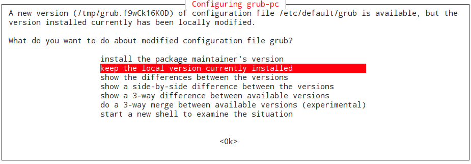
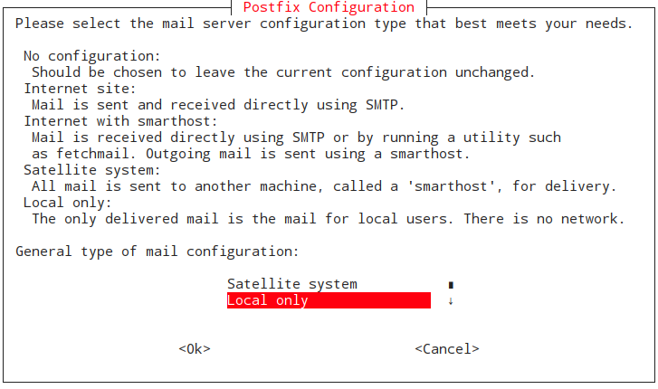
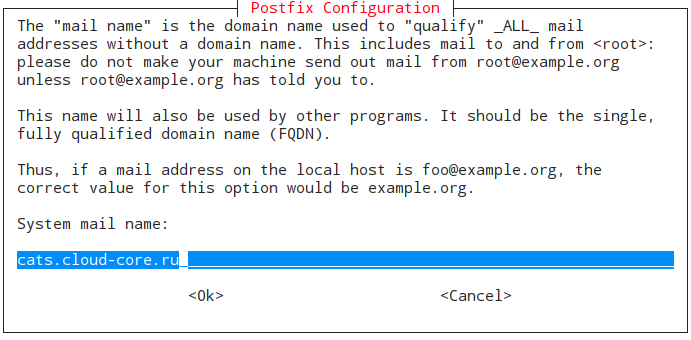
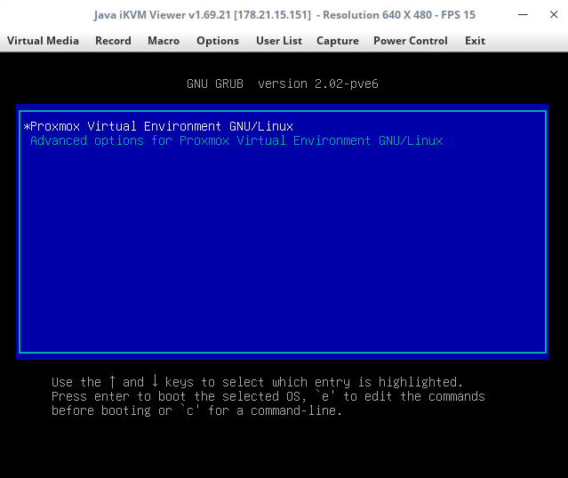
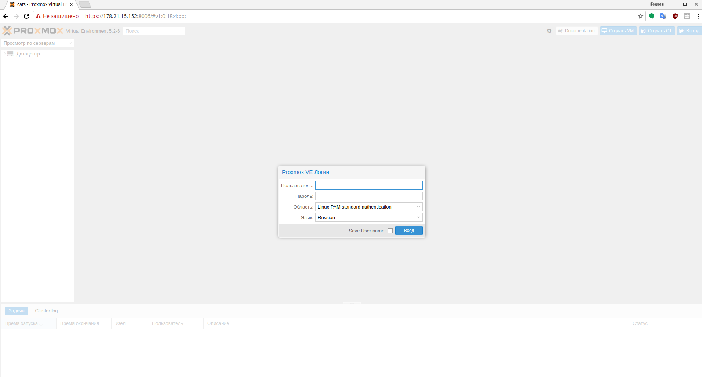

## Установка Proxmox VE на Debian 9 Stretch
[Proxmox Virtual Environment (Proxmox VE)](https://pve.proxmox.com/wiki/Main_Page) — система виртуализации с открытым исходным кодом, основанная на Debian GNU/Linux. Разрабатывается австрийской фирмой Proxmox Server Solutions GmbH, спонсируемой Internet Foundation Austria
>На момент установки системы виртуализаци Proxmox VE на сервере должен быть установлен Debian 9 Stetch, на сервере должен быть статический IP адрес. При установке Debian рекомендуется установить только стандартный набор пакетов, поскольку Proxmox VE предлагает свои собственные пакеты для qemu, lxc.

## Подготовка
Добавим IP-адрес сервера в файл `/etc/hosts` или, если он уже добавлен, убедимся, что имени хоста присвоен IPv4 адрес:
```sh
cat /etc/hosts
127.0.0.1	localhost
178.21.15.152	cats.cloud-core.ru

# The following lines are desirable for IPv6 capable hosts
::1     localhost ip6-localhost ip6-loopback
ff02::1 ip6-allnodes
ff02::2 ip6-allrouters
```
Как видим, имени хоста `cats.cloud-core.ru` соответствует адрес `178.21.15.152`.
Вы можете проверить корректность записи файла hosts командой:
```sh
hostname --ip-address
178.21.15.152
```
Добавим репозиторий Proxmox VE:
```sh
echo "deb http://download.proxmox.com/debian/pve stretch pve-no-subscription" > /etc/apt/sources.list.d/pve-install-repo.list
```
Добавим ключ репозитория Proxmox VE:
```sh
wget http://download.proxmox.com/debian/proxmox-ve-release-5.x.gpg -O /etc/apt/trusted.gpg.d/proxmox-ve-release-5.x.gpg
```
Обновим пакетную базу и установим обновления на сервер:
```
apt update && apt dist-upgrade
```
Во время установки будет сообщение о установке новой версии GRUB.

Нажимаем **install the package maintainer's version**, чтобы выполнить обновление загрузчика операционной системы [GRUB](https://ru.wikipedia.org/wiki/GNU_GRUB).
>Если на сервере используется другая архитектура (например, i386 для запуска более старого программного обеспечения), и пакетный менеджер apt сообщает о невозможности найти /binary-i386: «Unable to find expected entry 'pve/binary-i386/Packages», то необходимо удалить ПО, использующее архитектуру i386 и установить amd64 (Proxmox работает только на amd64):
```
deb [arch=amd64] http://download.proxmox.com/debian/pve stretch pve-no-subscription
```

## Установка пакетов Proxmox VE
Для установки пакетов Proxmoxe VE выполним команду:
```sh
apt install proxmox-ve postfix open-iscsi
```
При установке будет сообщение об удалении Exim и установке Postfix. Если нет дополнительных указаний о настройке почтового сервера, то выбираем **Local Only**.

Имя хоста оставляем прежнее:

Дожидаемся окончания установки и перезагружаем систему. Новое ядро Proxmox VE должно быть автоматически выбрано в меню GRUB.

>Рекомендуется удалить пакет os-prober:
```
apt remove os-prober
```
Пакет os-prober сканирует разделы системы, включая гостевые виртуальные машины, для создания записей GRUB, в случае установленных различных дистрибутивов на сервер. Если на сервере не установлено ничего кроме Proxmox VE, то рекомендуется удалить пакет os-prober.

После загрузки системы переходим в web-интерфейс Proxmox VE по адресу `https://сюда_ip_адрес:8006`:

Логин и пароль используем такие же как и для входа в систему.
>Чтобы получать последние обновления Proxmox необходимо добавить один из новых репозиториев пакетов, см. [Пакет репозиториев](https://pve.proxmox.com/wiki/Package_Repositories)

>**Необязательно:** можно удалить ядро Debian, которое больше не используется:
```sh
apt remove linux-image-amd64 linux-image-4.9.0-3-amd64
```
После этого необходимо обновить конфигурацию GRUB:
```sh
update-grub
```