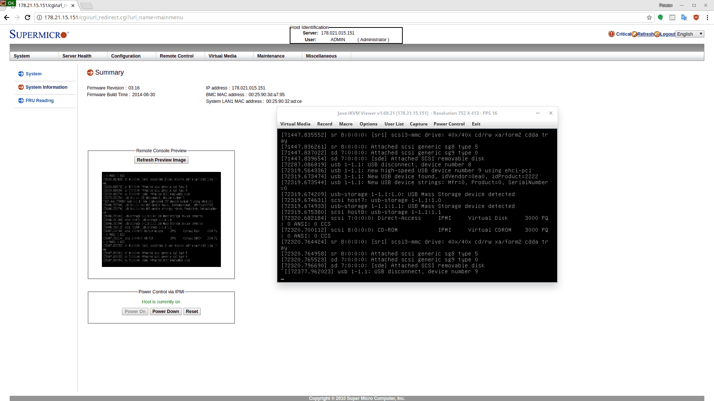
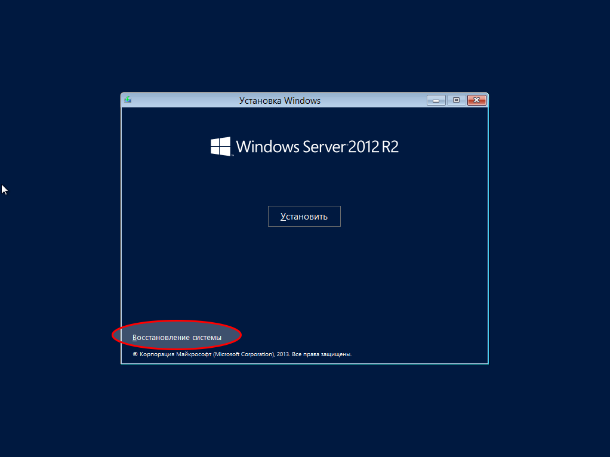
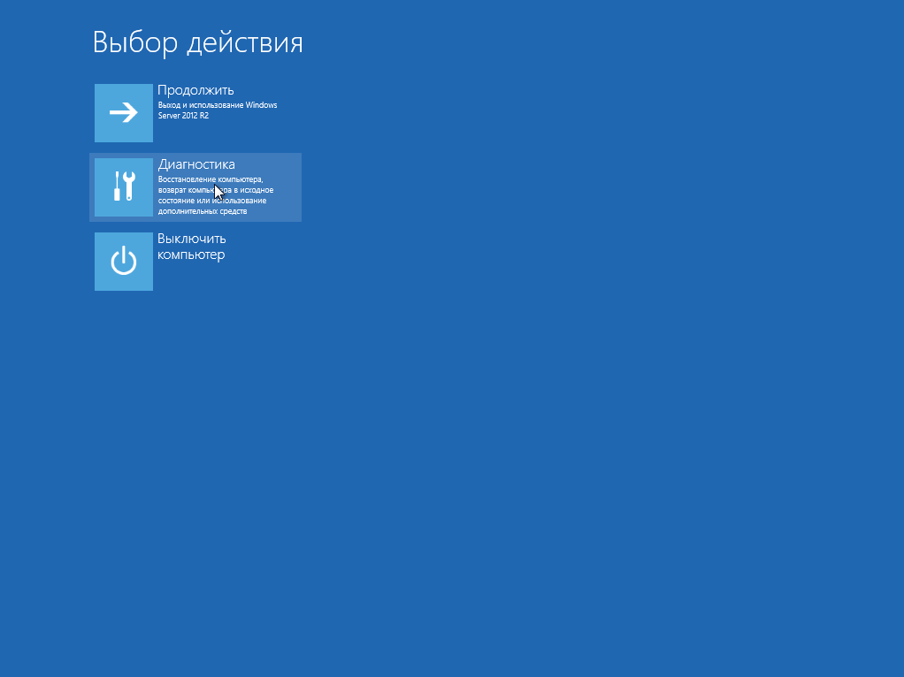

# Сброс пароля Windows Server
*В данной статье будет рассмотрен сброс пароля пользователя Администратор/Administrator на примере Windows Server 2012/2016*
Для сброса пароля пользователя Администратор необходимо иметь установочный образ Windows Server. 
Образы Windows Server можно скачать на сайте [cloud-core](https://cloud-core.ru/) (требуется подключение к корпоративному VPN):
1. Образ Windows Server 2016 (6.5Гб):  [Widows_Server_2016_RS1_Standard-DataCenter_x64_RU.iso](https://cloud-core.ru/downloads/ISO/Widows_Server_2016_RS1_Standard-DataCenter_x64_RU.iso)
2. Образ Windows Server 2012 (4.3Гб) Вы можете сказать на официальном сайте Microsoft
Также Windows server [Widows_Server_2012_R2_Standard-DataCenter_x64_RU.iso](https://cloud-core.ru/downloads/ISO/Widows_Server_2012_R2_Standard-DataCenter_x64_RU.iso)

Также данные образы можно скачать с официального сайта Microsoft, для этого достаточно выбрать образ ISO и ввести данные (можно выдумать): [Windows Server 2016](https://www.microsoft.com/ru-ru/evalcenter/evaluate-windows-server-2016/) и [Windows Server 2012 R2](https://www.microsoft.com/ru-ru/evalcenter/evaluate-windows-server-2012-r2)
После того, как образ был скачан, подключаемся к серверу через IPMI, либо KVM, загружаем образ в VirtualMedia.

После того, как образ был загружен, выполняем перезагрузку сервера. При загрузке ОС будет сообщение *Press any key to boot from CD or DVD*. Нажимаем любую клавишу и дожидаемся загрузки файлов. После загрузки файлов появится окно с выбором первоначальных параметров, жмём **Далее**.
После этого нажимаем **Восстановление системы**.

В выборе действия нажимает **Диагностика**

Далее выбираем **Командная строка**. Для начала необходимо найти системный диск, выполним команду:
```
echo %windir%
```
Команда выведет системный диск. Переходим в него:
```
C:
```
В случае, если диск C является системным. Далее переходим в System32:
```
cd Windows\System32
```
Далее переименовываем Utilman.exe на Utilman.exe.old:
```
ren Utilman.exe Utilman.exe.old
```
и выполняем замену cmd на Utilman.exe
```
copy cmd.exe Utilman.exe
```
После этого закрываем консоль и нажимаем кнопку **Продолжить**. После загрузки сервера появится экран ввода логина и пароля. Нажимаем **Win + U** и вводим следующую команду:
```
net user Администратор new_password
```
где new_password -- новый пароль пользователя Администратор. В EN-локализации пользователь имеет названиме Administrator.

# Источники:
1. [СБРОС ПАРОЛЯ НА WINDOWS SERVER 2012
](http://breys.ru/2052.html)
2. [Сброс пароля Windows Server 2012](https://dmitryz.wordpress.com/2014/12/08/drop-pass-windows-server-2012/)
3. [Как найти системный диск](http://forum.oszone.net/thread-129149.html)
