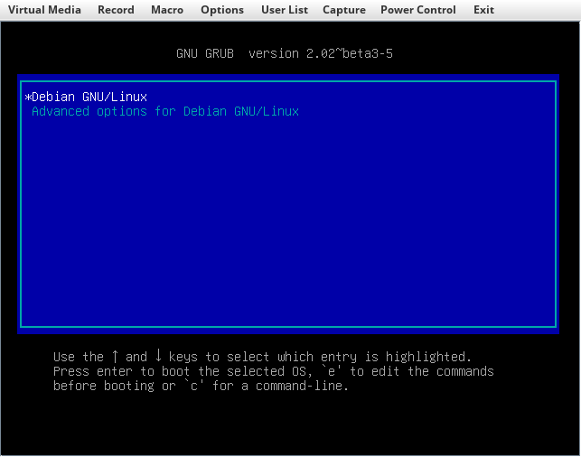
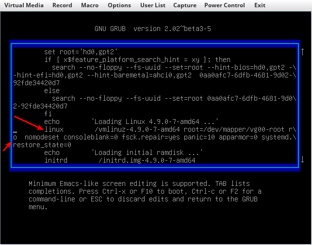
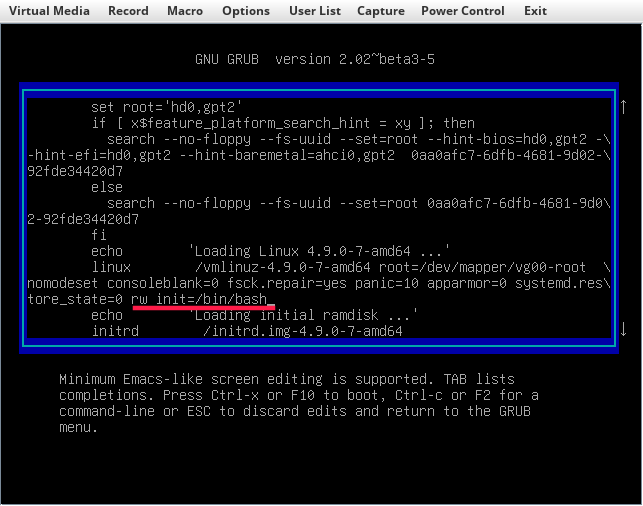
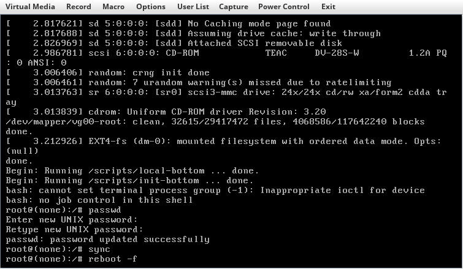

# Сброос пароля пользователя root на Linux-like OS
В случае, если есть актуальный пароль пользователя root, то для сброса пароля root необходимо ввести команду `passwd` из под пользователя root и два раза ввести новый пароль.
```
root@cats:~# passwd
Enter new UNIX password:
Retype new UNIX password:
passwd: password updated successfully
```
В случае, если root пароль окончательно утерян, то подключаемся к консоли сервера с помощью IPMI, либо KVM. Если сервер включен, то перезагружаем его, используя комбинацию клавиш **Ctrl+Alt+Del** на виртуальной клавиатуре. После загрузки BIOS появится меню загрузчика GRUB.

Если данное меню не появилось и началась загрузка ОС, значит в файле /etc/default/grub установлен параметр `GRUB_TIMEOUT=0`, который не позволяет выбрать ОС на этапе загрузки. Чтобы меню GRUB появилось перезагружаемся и удерживаем **Shift** до появления меню.
Чтобы сбросить пароль необходимо загрузиться в ОС в однопользовательском режиме (single mode). Для этого в меню GRUB нажимаем **e** -- после этого необходимо отредактировать строку начальной загрузки, которая обычно начинается с *linux /vmlinuz-...*

Параметр *ro* (read-only) отвечает за загрузку ядра Linux в режиме "только чтение". Чтобы после сброса root пароля изменения были сохранены необходимо заменить *ro* на *rw* (read-write) -- режим "чтение-запись". Далее необходимо указать запуск командной оболочки bash, прописав вконце строки *init=/bin/bash*. Итого строка загрузки, для данного примера, примет следующий вид:
```
linux	/vmlinuz-4.9.0.-7-amd64 root=/dev/mapper/vg00-root rw nomodeset consoleblank=0 fsck.repair=yes panic=10 apparmor=0 systemd.restore_state=0 init=/bin/bash
```

>Параметр *rw* необязательно прописывать в строку начальной загрузки. Изменить режим работы в одиночном режиме возможно после загрузки системы выполнив команду:
```
mount -o remount,rw /
```

После этого необходимо нажать **Ctrl+X** или **F10** и дождаться загрузки ОС в однопользовательсом режиме. После того как загрузка завершена, появится командная строка от пользователя root. Если режим *ro* не был изменен на *rw* или прописан в строку начальной загрузки, то необходимо сначала установить режим "чтение-запись" командой:
```
mount -o remount,rw /
```
Далее, для установки нового root пароля необходимо ввести команду:
```
passwd
```
и дважды ввести новый пароль пользователя root. Далее необходимо сохранить изменения на диск и перезагрузить систему:
```
sync
reboot -f
```

Если выполняется сброс root пароля на CentOS, и после смены пароля системе не перезагружается, то выполняем следующую команду:
```
sync;sync;sync; echo b > /proc/sysrq-trigger
```

# Источники
1. [Сброс забытого пароля](http://help.ubuntu.ru/wiki/%D1%81%D0%B1%D1%80%D0%BE%D1%81_%D0%BF%D0%B0%D1%80%D0%BE%D0%BB%D1%8F)
2. [Сброс пароля в Gentoo](https://losst.ru/sbros-parolya-v-gentoo)
3. [Как сбросить root-пароль в Ubuntu 16.04.04](https://www.servers.ru/knowledge/linux-administration/how-to-reset-the-root-password-on-ubuntu-16_04)