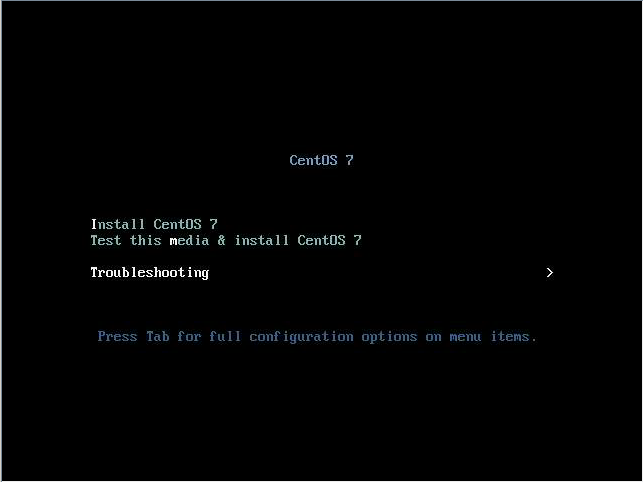

## Восстановление работоспособности системы Linux после переноса дисков в подменную платформу

*В данной статье рассмотрено восстановление системы после переноса дисков в аналогичную платформу.*

В общем случае, при переносе дисков с операционной системой Linux в подменную платформу могут наблюдаться проблемы с загрузкой системы, как следствие изменнения UUID разделов, изменения наименования разделов при инициализации системы, изменения наименования сетевых интерфейсов системы. Для устранения вышеописанных проблем потребуется выполнить следующие действия:
1. Обновить записи о инициализируемых разделах fstab,
2. Если в системе установлено программный RAID массив, то необходимо обновить информацию о разделах RAID в файле конфигурации mdadm.conf,
3. Перегенерировать initramfs,
4. Скорректировать наименование сетевых интерфейсов.

После переноса дисков в новую, аналогичную платформу при загрузке операционной системы можно наблюдать подобное сообщение (для CentOS):
```
dracut-initqueue[249]: Warning: Could not boot
dracut-initqueue[249]: Warning: /dev/mapper/root does not exist
Entering emergency mode. Exit the shell to continue.
```
После этого будет запущена командная оболочка dracut. Проблема связана с тем, что менеджер загрузки не может найти диск с указанным UUID, т.к. после смены платформы он изменился.
В большинстве случаев, для устранения данной проблемы в командной оболочке потребуется ввесли следующие команды:
```sh
lvm vgscan
lvm vgchange -ay 
```
после этого выполняем команду `exit` и перезагружаемся:
```
exit
reboot
```
Если после выполнения команды `lvm scan` логические тома не были найдены, то необходимо выполнить загрузку с LiveCD операционной системы. 

## Загрузка с образа LiveCD и изменение корневого каталога файловой системы

LiveCD образ возможно скачать на официальном сайте конкретного дистрибутива. Рекомендуется скачивать LiveCD той же версии что и версия ОС на дисках.
Для CentOS - после того, как LiveCD будет загружен в систему, на стартовом экране необходимо выбрать **Troubleshooting** и далее выбрать **Rescue a CentOS Linux System**. Для других операционных систем Linux необходимо загрузиться в режим восстановления Rescue.

После того, как Live-система будет загружена, выполним просмотр всех логических томов:
```sh
ls /dev/mapper
```
Будет выведен список томов, примерно следующего содержания:
```
/dev/mapper/vg00-root /dev/mapper/vg00-swap
```
Далее необходимо создать директорию для монтирования раздела vg00-root:
```sh
mkdir /mnt/root
```
Выполняем монтирование тома в созданный раздел:
```sh
mount /dev/mapper/centos-root /mnt/root
```
Монтируем основные системные директории:
```sh
mount -o bind /dev /mnt/root/dev
mount -o bind /sys /mnt/root/sys
mount -o bind /proc /mnt/root/proc
```
Также выполняем монтирование /boot раздела:
```
mount /dev/sda1 /mnt/root/boot
```
Меняем корневой каталог:
```
chroot /mnt/root
```
После выполнения команды `chroot` все выполняемые далее команды будут выполняться для системы в которую выполено изменение корневого каталога.

## Корректировка fstab

После переноса дисков в новую платформу, вероятно, что UUID разделов при инициализации изменились. Необходимо скорректировать информацию о разделах в файле fstab. Актуальную информацию по UUID можно получить выполнив команду:
```sh
blkid
```
или
```sh
lsblk -f
```
Далее открываем любым возможным редактором файл fstab и корректируем записи о разделах.
```sh
vim /etc/fstab
```
Подробнее о записях в fstab можно ознакомиться в статье [Монтирование разделов и fstab](https://cloud-core.ru/kb/montirovanie-razdelov-i-fstab#zapis-v-fayl-fstab).

## Корректировка mdadm

Обновим информацию о программном RAID-массиве в файле конфигурации mdadm.conf.
! Файл конфигурации mdadm.conf для CentOS и Debian отличаются в своем местоположении.
Для CentOS 7:
```sh
mdadm --detail --scan --verbose > /etc/mdadm.conf
```
Для Debian:
```sh
echo "DEVICE partitions" > /etc/mdadm/mdadm.conf
mdadm --detail --scan --verbose | awk '/ARRAY/ {print}' >> /etc/mdadm/mdadm.conf
```

## Генерация initramfs

Перегенерируем initramfs. 
В операционной системе CentOS генерация initramfs выполняется с помощью dracut:
```sh
dracut -f
```
! Данная команда перегенерирует initramfs только для одной версии ядра. Если необходимо перегенерировать initramfs для определенного образа ядра Linux, то необходимо использовать следующую команду:
```
dracut <имя_образа_ядра>
```
В операционной системе Debian обновление initramfs выполняется следующей командой:
```
update-initramfs -u
```

## Обновление информации загрузчика GRUB

Обновляем файл конфигурации загрузчика GRUB.
Для CentOS:
```sh
grub2-mkconfig -o /boot/grub2/grub.cfg
```
Для Debian:
```sh
update-grub
```
! Перегенерация initramfs в CentOS и файла конфигурации GRUB можно выполнить также и одной командой:
```sh
dracut --regenerate-all -f && grub2-mkconfig -o /boot/grub2/grub.cfg
```

## Корректировка сетевых настроек

После переноса дисков в новую платформу может измениться название сетевых интерфейсов в системе. Необходимо скорректировать наименования интерфейсов в файле/файлах конфигурации сетевого/сетевых интерфейсов. 
Для CentOS сетевые настройки находятся в директории:
```
/etc/sysconfig/network-scripts/
```
Для Debian сетевые настройки находятся в файле:
```
/etc/network/interfaces
```
Актуальные наименования всех сетевых интерфейсов в системе можно узнать выполнив следующую команду - 
для CentOS
```sh
ifconfig
```
для Debian
```sh
ip a
```
Далее открываем файл конфигурации сетевого интерфейса и устанавливаем новые наименования сетевых интерфейсов в соответствие с выводом команды `ifconfig` или `ip a`.

После всех выполненных действий, выходим из chroot, синхронизируемся и перезагружаемся.
```sh
exit
sync
reboot
```

## Источники:
1. [Centos 7 dracut boot recovery](https://exebit.wordpress.com/2015/11/20/centos-7-dracut-boot-recovery/)
2. [CentOS 7.0 - man page for dracut (centos section 8)](https://www.unix.com/man-page/centos/8/dracut/)
3. [update-initramfs(8)](https://manpages.debian.org/jessie/initramfs-tools/update-initramfs.8.en.html)
4. [LiveCdRecovery](https://help.ubuntu.com/community/LiveCdRecovery) 