## Установка SSL-сертификат на сервер с панелью ISPmanager
*В данной статье будет рассмотрена установка SSL-сертификата на сервер с использованием панели управления сервером ISPmanager 4 и 5 версии*
### ISPmanager 4
Для установки SSL-сертификата в панели ISPmanager 4 необходимо выполнить следующие действия:
1. Разрешить созданному пользователю доступ к SSL-сертификатам:
 - Зайти на сервер под пользователем root,
 - Переходим в раздел **WWW-домены**, чтобы определить какому пользователю на сервере пренадлежит доменное имя.
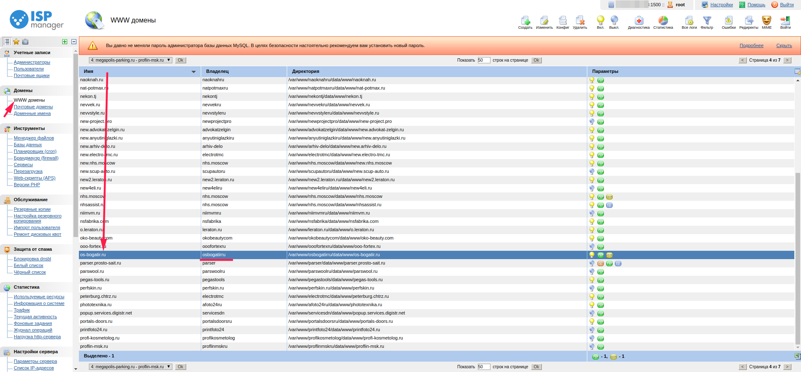
 - Перейти в раздел **Пользователи** и выделить пользователя, под которым размещается сайт, кликнуть по кнопке **Изменить** в верхней панели,
 - В открывшемся окне во вкладке права установить флаг напротив пункта SSL, сохранить изменения, нажав **Ок**.
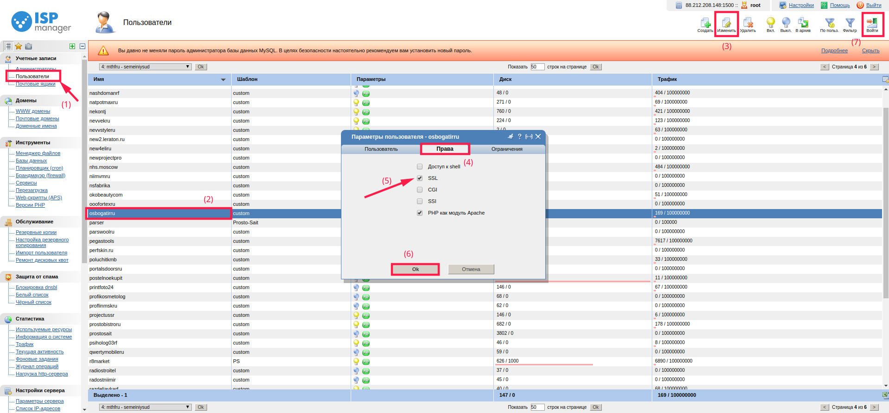
2. Авторизоваться под пользователем, для которого установили доступ к SSL-сертификатам, нажав кнопку **Войти** в верхней панели,
3. В пункте World Wide Web нажать **SSL сертификаты**.
4. Добавить сертификат:
 - нажать кнопку **Создать** в верхней панели, появится окно добавления сертификата:
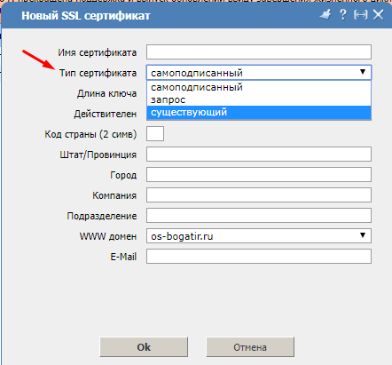
 - Далее необходимо заполнить поля:
Имя сертификата -- любое имя, для удобства рекомендуется устанавливать имя домена для которого куплен SSL-сертификат и год окончания действия SSL-сертификата, например `os-bogatir.ru_2019`,
Тип сертификата -- существующий,
Использовать ключ -- указать вручную,
Приватный ключ -- вставить содержимое Private key. Приватный ключ имеет следующу строку в начале 
```
----BEGIN PRIVATE KEY----
Данные приватного ключа
----END PRIVATE KEY----
```
Сертификат -- вставить содержимое файла `доменное имя.crt`, предоставленного поставщиком сертификата,
Пароль -- стоит заполнять только в том случае, если устанавливали пароль на приватный ключ перед созданием сертификата.
Цепочка сертификатов -- содержимое дополнительных цепочек, обычно это файл `.ca-bundle`. Если цепочек несколько порядок их установки нужно уточнять у поставщика сертификата,
В результате должно получится следующее:
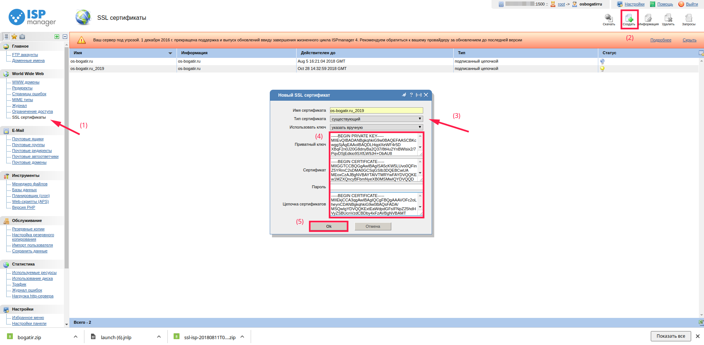
5. Включить сертификат для нужного домена.
Для этого необходимо перейти в меню **WWW-домены**, выбрать нужный домен, нажать кнопку **Изменить**, включить опцию **SSL** и выбрать нужный сертификат из списка:
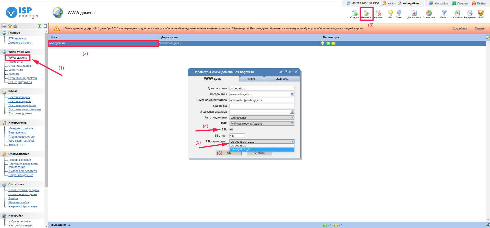
Если домен еще не добавлен - нужно нажать кнопку **Создать** и включить опцию “SSL” при добавлении домена.
После всех этих настроек статус сертификата изменится на "Установленный":
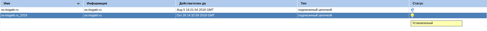

Выполняем проверку установки SSL-сертификата:
https://www.sslshopper.com/ssl-checker.html
Как видим, SSL-сертификат установлен:
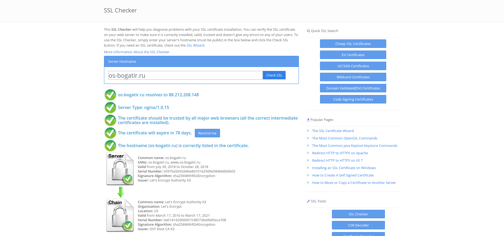

>Если по какой-либо причине после выполненных действий SSL-сертификат не будет проходить проверку, рекомендуем выполнить перезагрузку web-сервера:
```
service nginx restart
```
или 
```
service httpd restart
```
или (если на сервере установлена Debian-based ОС)
```
service apache2 restart
```

## ISPmanager 5
Для установки SSL-сертификата в панели ISPmanager 5 необходимо выполнить следующие действия:
1. Зайти в ISPmanager под пользователем, которому принадлежит домен. Войдя под пользователем root это можно сделать так: **WWW-домены** - выбрать необходимый домен, для которого требуется установить SSL-сертификат - нажать **Войти** в верхней панели:
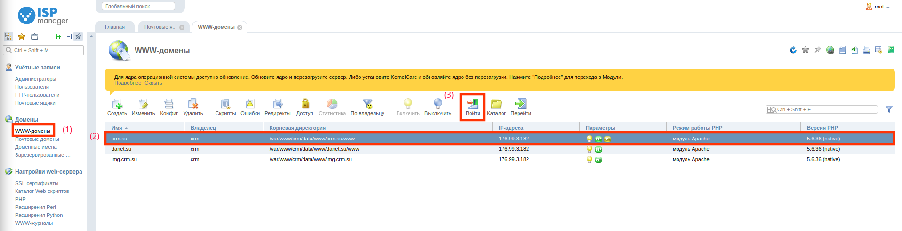
2. Нажимаем **SSL-сертификаты**, в верхней панели нажимаем **Создать**.
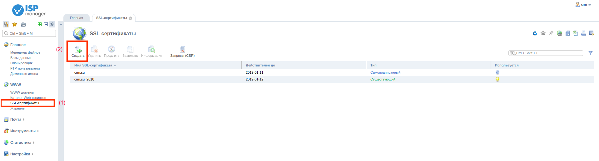
Если данной кнопки нет (**SSL-сертификаты**), то необходимо включить возможность использования SSL-сертификатов для данного пользователя. Для этого из под пользователя root перейдите в **Пользователи**, выберете пользователя домена и нажмите **Изменить**:
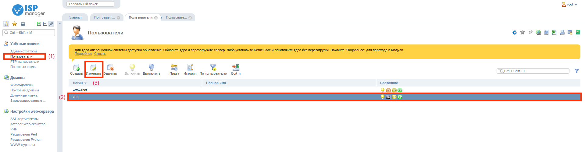
В открывшемся окне установить флаг напротив **Может использовать SSL**. Сохранить изменения, нажав **Ок**:
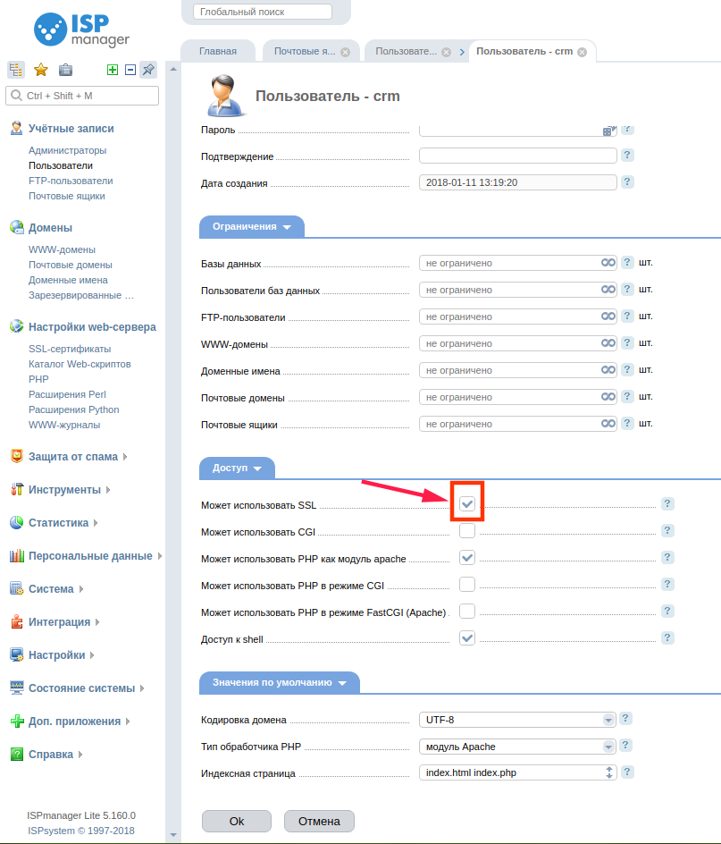
3. В меню создания SSL-сертификата выбираем **Существующий** и нажимаем **Далее**. В следующем окне заполняем поля:
**Имя сертификата** - имя сертификата, под которым он будет отображаться в системе. Может содержать буквы латинского алфавита, цифры, точки, а также знаки _ и -
**Приватный ключ** - укажите содержимое файла приватного ключа,
**Сертификат** - укажите содержимое файла SSL-сертификата
**Пароль** - указывайте, если ключ сертификата зашифрован (обычно не требуется),
**Цепочка сертификатов** - Certificate bundle: цепочка сертификатов, которыми подписан данный сертификат. В письме от центра сертификации обычно приходит архив, в котором есть два файла - сам сертификат и цепочка сертификата (файл с расширение .ca-bundle)
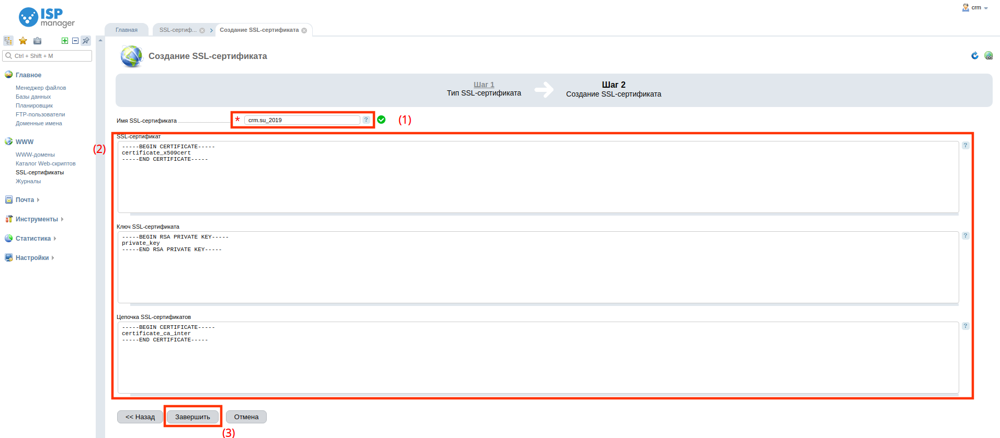
4. После успешного добавления сертификата необходимо перейти в раздел **WWW домены**, выбрать домен, и нажать **Изменить**. В появившемся окне необходимо установить флаг напротив **Защищенное соединение** и выбрать SSL-сертификат из списка, нажать **ОК**:
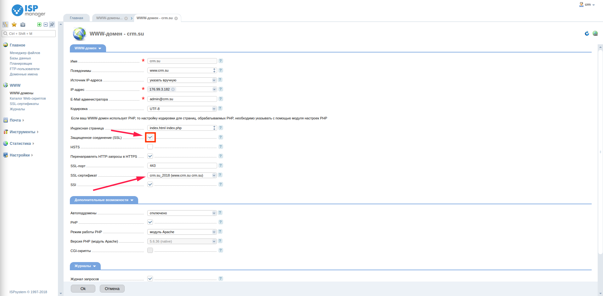
5. Проверить установку SSL-сертификата сервисом https://www.sslshopper.com/ssl-checker.html
>Если потребуется перезагрузитб web-сервер, то в ISPmanager 5 есть возможность сделать это из панели: необходимо перейти в **Службы**, в открывшемся окне выбрать используемый web-сервер, нажать **Рестарт**.

## Источники:
1. [Установка SSL-сертификата](https://doc.ispsystem.ru/index.php/%D0%A3%D1%81%D1%82%D0%B0%D0%BD%D0%BE%D0%B2%D0%BA%D0%B0_SSL_%D1%81%D0%B5%D1%80%D1%82%D0%B8%D1%84%D0%B8%D0%BA%D0%B0%D1%82%D0%B0)
2. [Подключение SSL в ISP 4](https://www.ukraine.com.ua/faq/podklyuchenie-ssl-v-isp-4.html#!37)