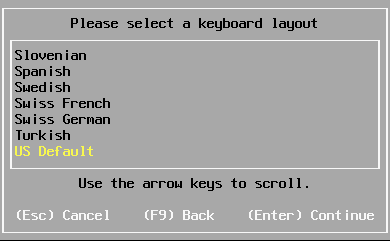
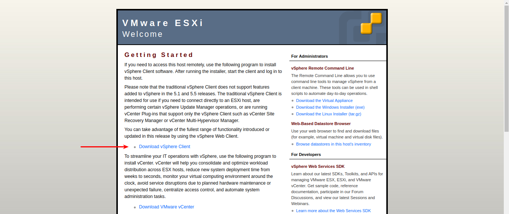
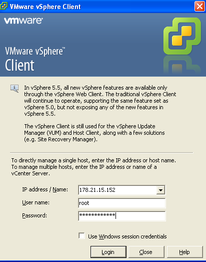

*В данной статье будет рассмотрен вариант установки аппаратного гипервизора ESXi vSphere от компании VMware.*

Перед установкой необходимо скачать [образ VMware ESXi vSphere](https://my.vmware.com/en/web/vmware/evalcenter?p=free-esxi6) с сайта производителя. Чтобы скачать образ необходимо зарегистрироваться в системе. После регистрации будет предоставлен бесплатный ключ лицензии для ESXi vSphere. Перед началом установки также необходимо [проверить на сайте](https://www.vmware.com/resources/compatibility/search.php) совместимость комплектующих сервера с используемой версийе VMware ESXi vSphere.

1. Записываем образ на USB-накопитель и подключаем к серверу и выставляем в BIOS приоритет загрузки или подключаем образ в VirtualMedia KVM/IPMI и выполняем загрузку с него.
2. После того, как образ загружен, увидим начальный экран загрузки VMwaver ESXi.

Выбираем ESXi Installer и нажимаем **Enter**.
3. Далее последует прогресс загрузки.

Дожидаемся процесса загрузки.

4. В следующем окне нажимам **Enter**, чтобы начать установку.

5. Далее соглашаемся с условиями лецензионного соглашения VMware ESXi и нажимаем **F11** для продолжения.

6. Далее выбираем диск куда будет установлен ESXi vSphere.

Нажимаем **Enter**.
>ESXi не поддерживает создание программного RAID-массива. Если для гипервизора необходима надежность, то необходимо устанавливать аппаратный RAID-контроллер.

7. В следующем окне предлагается выбрать языковую раскладку. Возможно выбрать русскую раскладку. Выбираем **US Default**, нажимаем **Enter**.

8. Далее вводим используемый root пароль. Временно пароль можем установить запоминаемый пароль. После установки мы можем его изменить.

9. Далее система установки предупредит, что выбранный диск будет отформатирован. Нажимаем **F11** для установки

10. Дожидаемся завершения процесса установки.

По завершению установки. Отключаем флешку/виртуальный диск, нажимаем **Enter**, чтобы перезагрузить систему.

Дожидаемся загрузки сервера ESXi.

## Послеустановочные настройки

После установки гипервизора ESXi показан начальный экран работы с ESXi.

1. Как видно, IP-адрес (188.93.208.9) для работы с гипервизором был подключен автоматически по DHCP. Данный IP адрес может пренадлежать другому клиенту. Поэтому необходимо скорректировать настройки сети и установить статический IP-адрес. 
 - Нажимаем **F2** и в следующем окне вводим root пароль, который был задан при установке. Нажимаем **Enter**.

 - В следующем окне выбираем **Configure Manage Network**.

 - Из списка выбираем **IP Configuration**.

 - Выбираем **Set static IP address and network configuration**, нажимаем пробел и устанавливаем IP-адрес, маску подсети и шлюз в соответствие с выданными сетевыми настройками. Нажимаем **OK**.
 
 - Переходим в **IPv6 Configuration** и выключаем (если не используется) IPv6. Выбираем **Enable IPv6 (restart required)**, снимаем флаг, нажав проблел и нажимаем **OK**.
 - Далее переходим в **DNS Configuration** и устаналиваем основной и альтернативный DNS серверы и имя хоста. В качестве DNS-серверов возможно использовать DNS-серверы Google - 8.8.8.8 и 8.8.4.4.
 
 - После того как все настройки введены, нажимаем **Esc**, система запросит перезагрузку хоста. Нажимаем **Y** - перезагружаемся.

2. После перезагрузки снова вводить пароль root и входим в панель управления.
 - Переходим в **Configure Password**,
 - Вводим старый пароль, новый и подтверждение нового пароля.
 
 Нажимаем **OK**.

На данном этапе установка VMware ESXi vSphere закончена. 

Для управления сервером VMware ESXi необходимо скачать клиент VMware ESXi vSphere Client по адресу `http://<ip_адрес_сервера_ESXi>` и установить на локальный компьютер. Ссылка **Download vSphere Client**.

>Клиент требуемой версии также возможно [скачать на сайте VMware](https://kb.vmware.com/s/article/2089791).

После установки клиента вводим данные для доступа на сервер и переходим в управление сервером.

## Источники
1. [Как установить VMware ESXi. Инструкция по установке сервера ESXi 4 из состава vSphere.](https://www.vmgu.ru/articles/vmware-esxi-4-vsphere-setup)
2. [vSphere 5.5 - How to install and configure VMware ESXi 5.5](https://www.youtube.com/watch?v=UVv5K8RItYc)