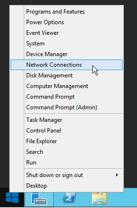

*В этой статье рассмотрена установка операционной системы Windows Server Standard на примере Windows Server Standard 2012 R2 в английской локализации. Также показана послеустановочная настройка сети, настройка доступа по RDP, первоначальная настройка сетевого экрана и сборка программного RAID-1 и RAID-0 массивов и создание разделов.*

## Установка операционной системы
1. Подключаемся к серверу через IPMI/KVM и монтируем образ в VirtualMedia или записываем образ ОС на USB-накопитель и подключаем его к серверу.
2. Выставляем в BIOS приоритет загрузки для VirtualMedia IPMI/KVM или USB-накопителя и загружаемся с него.
3. Если на сервере аппаратный RAID-контроллер, то на следующем шаге собираем RAID-массив согласно заказу. Сборка массива в зависимости от модели контроллера может отличаться.
4. После загрузки образа в приветственном окне оставляем все параметры стандартными, нажимаем **Next**.

В следующем окне нажимаем **Install Now**.

5. Выбираем нужную версию: Standard или Datacenter, обязательно с графическим интерфейсом (Server with a GUI / Desktop Experience).

Нажимаем **Next**.

6. Принимаем лицензионное соглашение - на следующем шаге необходимо установить флаг напротив **I accept the license terms** и нажать **Next**.
7. На следующем шаге выбираем только установку Windows, нажимаем **Custom: Install Windows Only (advanced)**.


8. Разбивка.
- Если создан аппаратный RAID-массив, то производим установку на собранный массив (обычно Drive 0). Например, 2 диска объединенные в RAID1-1 массив на этапе разметки диска будут видны, как один диск. Для аппаратного RAID-контроллера на этапе разметки дисков потребуются драйвера для контроллера. Исходя из модели используемого в сервере контроллера, находим драйвера в Google и записываем на USB-накопитель и подключаем к серверу или запрашиваем драйвера у Виктора Горчак.
- Если в заказе указан программный RAID-массив, то выполняем разбивку диска, согласно заказу.

 Рассмотрим общий случай установки ОС Windows Server Standard с использованием программного RAID-массива. На сервере используется следующая дисковая конфигурация и указана разбивка дисков:
 
|      Диски      	| Уровень RAID 	|              Разделы и пространство             	|
|:---------------:	|:------------:	|:-----------------------------------------------:	|
|  2 X 240 GB SSD 	|    RAID-1    	| C: 70 GB, D: - остальное пространство в массиве 	|
| 2 X 500 GB SATA 	|    RAID-0    	|                E: 250GB, F: 250GB               	|

 >?С учётом того, что операционная система считает объем дискового пространства в двоичных байтах, объёмы дисков немного уменьшатся: 2 X 223,6 GB, 2 X 465,8 GB.

 Создаём разделы C: (системный диск) и D: только на диске 0 (Drive 0), так как после установки ОС диск 1 (Drive 1) будет использован для создания "зеркала" из диска 0 и диска 1.

 Выбираем **Drive 0** (1), нажимаем **New** (2), устанавливаем значение объёма раздела **Size, Mb** (3), нажимаем **Apply** и обязательно соглашаемся с созданием загрузочного раздела для ОС Windows. После выполненных действия диск C: примет тип Primary. На данный раздел будет установлена ОС.

 Разметку диска D: на данном этапе можно не выполнять, так как сейчас главное установить ОС. Разметкой диска D: займемся после установки ОС.
 После всех выполненных действий нажимаем **Next** и дожидаемся завершения процесса установки ОС. Система будет перезагружена по завершению установки.


## Послеустановочные настройки операционной системы
После перезагрузки системы выполняем нижеуказанные действия по донастройке системы.

### Установка пароля пользователя Administrator

1. После установки ОС, устанавливаем пароль для пользователя Администратор. Можно устанавливать сразу сложный пароль или установить лёгкий (пароль должен выполнять требования сложности пароля), но после завершения настроек сервера рекомендуется его заменить на сложный. После ввода пароля нажимаем **Finish**.
2. Далее вводим пароль пользователя Administrator и заходим на сервер.

### Настройка сети на сервере

Следующим шагом будет настройка сети на сервере. 
1.  Нажимаем **Start** (клавиша **Win**) и выбираем **Control Panel**.
  
2. В панели управления нажимаем **Network and Internet** (1) и выбираем **Network and Sharing Center** (2).
3. В боковой панели нажимаем **Change adapter settings** (3) **(!)**, выбираем сетевой интерфейс и нажимаем правой кнопкой мыши, выбираем **Properties** (4). 
4. В открывшемся окне выбираем **Internet Protocol Version 4 (TCP/IPv4)** (5), нажимаем **Properties** (6).
5. Вводим IP адрес (IP address), маску (Subnet mask) и шлюз (Default Gateway) (7). Предпочитаемый и альтернативный DNS сервера можно установить любые, например от Google - 8.8.8.8 и 8.8.4.4, соответственно (8). Нажимаем **OK** (9) и после подключения к сети будет предложено включить сетевое отображение - нажимаем **No**.
 
   >? [(!)]Сразу перейти к настройкам сети возможно нажав правой клавишей мыши на символ Windows и выбрав **Network Connections**.
   >? 

### Настройка подключения по RDP

Настраиваем удаленные подключения по RDP.
1. нажимаем правой кнопкой мыши на символ Windows и выбираем **System**.
 
2. В открывшемся окне нажимаем **Remote Settings** (1).
3. В открывшемся окне открываем вкладку **Remote** (2) и устанавливаем флаг напротив **Allow remote connections to this server**, флаг с **Allow connections only from computer running Remote Desktop with Network Level Authentication (recomended)** снимаем (3).
4. Нажимаем **Apply** и **OK**.
  
5. Чтобы разрешить подключение по RDP, переходим к настройкам сетевого экрана Windows **(!)**.	
6. Нажимаем **Start** (клавиша **Win**) и выбираем **Control Panel**.
7. Нажимаем **System and Security**.
8. В открывшемся окне нажимаем **Windows Firewall**.
9. В открывшемся окне нажимаем **Advanced settings**.
10. Нажимаем **Inbound Rules** (1).
11. Выделяем **Remote Desktop - Shadow (TCP-In)**, нажимаем правой кнопкой мыши, выбираем **Properties** (2).
12. В открывшемся окне переходимся во вкладку **Advanced** (3) и устанавливаем флаги напротив всех профилей (4).

13. Нажимаем **Apply** и **OK**.
14. Повторяем для **Remote Desktop - User Mode (TCP-In)** и **Remote Desktop - User Mode (UDP-In)**.
 >? [(!)] На Windows Server Standard 2016 правила сетевого экрана, разрешающие подключение по RDP включаются автоматически. На остальных версиях необходимо включать вручную.

### Изменение имени сервера и группы
Сразу меняем имя сервера и группу.
1. Нажимаем правой кнопкой мыши на символ Windows и выбираем **System**.
2. Нажимаем **Advanced system settings** (1).
3. В открывшемся окне переходим во вкладку **Computer name** (2) и нажимаем **Change** (3).
4. Заполняем поле **Computer name** в формате REGRU-[Номер сервера], в поле **Workgroup** вписываем SERVER (4).
5. Нажимеем **OK**

После смены имени и группы система проинформирует, что имя и группа изменяться после перезагрузки системы. Нажимаем **Restart Later**.

### Установка драйверов

Проверяем установленные драйвера.
1. Нажимаем **Start** (клавиша **Win**) и выбираем **Device Manager**.
2. Проверяем, что все драйвера установлены. В случае, если драйверов для каких-то устройств нет - устанавливаем, выбрав устройство в раскрывающейся ветви и нажав **Install Driver Software**. Выбираем установку по интернету или с USB-накопителя.
3. Если драйверов нет в интернете, обращаемся к Виктору Горчак.

### Настройка сетевого экрана
Далее можем продолжать установку, подключившись к серверу по RDP **(!)**.
>? [(!)] Используя  клиент для подключения по RDP Remmina, развернём экран используя клавишу **Toggle dynamic resolution update** на бокой панели.
>? 

Отключаем правила сетевого экрана.
1. Нажимаем **Start** (клавиша **Win**) и выбираем **Control Panel**.
2. Нажимаем **System and Security**.
3. В открывшемся окне нажимаем **Windows Firewall**.
4. В открывшемся окне нажимаем **Advanced settings**.
5. Нажимаем **Inbound Rules**.
6. Отключаем все правила выделенные на скриншоте.

Для этого выбираем правило, нажимаем на нём правой кнопкой мыши, выбираем **Properties**, в открывшемся окне снимаем флаг напротив **Enabled**. Сохраняем, нажимаем **OK**.

### Отключаем SMB

Отключаем SMB для предотвращения атак до обновления системы.
1. Открываем PowerShell: символ Shell на нижней панели или набираем PowerShell в открытой панели Start.
2. Вводим следующие команды **(!)**:
   ```
   Set-SmbServerConfiguration -EnableSMB2Protocol $false -Force
   Set-SmbServerConfiguration -EnableSMB1Protocol $false -Force
   ```
   >? Чтобы вставить скопированную команду в PowerShell необходимо нажать правой кнопкой мыши в поле PowerShell.

### Изменение пароля пользователя Administrator

Меняем пароль пользователя Administrator.
1. Нажимаем правой кнопкой мыши на символ Windows и выбираем **Computer Management**.
2. Раскрываем ветку **Local Users and Groups**, выбираем **Users** (1).
3. Выбираем пользователя **Administrator** (2).
4. Нажимаем правой кннопкой мыши, выбираем **Set Password** (3).
5. Вводим пароль и подтверждение, нажимаем **OK** (4).

После выполненных действий выполняем перезагрузку сервера для применения настроек.

### Установка сервера терминального лицензирования

После перезагрузки устанавливаем сервер терминального лицензирования, понадобится для активации RDS.
1. Переходим в управление сервером **Server Manager** на нижней панели.
2. Нажимаем **Add roles and features**.
3. Открываем вкладку **Server Roles** (1).
4. Устанавливаем флаг напротив **Remote Desktop Services** (2).

5. Появится вкладка **Role Services** под **Remote Desktop Services**.
6. Нажимаем **Role Services** (3) и устанавливаем флаг напротив **Remote Desktop Licensing** (4).

7. В следующем окне нажимаем **Add features**.
8. Если в заказе более 2-х лицензий RDS, то дополнительно устанавливаем узел сеансов **Remote Desktop Session Host**.
8. Нажимаем **Next** и ожидаем завершения процесса установки.

Настраиваем лицензирование через групповую политику.
1. В PowerShell вводим 
```
gpedit.msc
```
2. Далее открываем дерево папок следующего пути `Computer Configuration > Administrative Templates > Windows Components > Remote Desktop Services > Remote Desktop Session Host > Licensing` (1).
3. Нажимаем правой кнопкой мыши на **Use the specified Remote Desktop license servers**, выбираем **Edit** (2). 
4. Устанавливаем флаг **Enabled** (3).
5. Вводим IP сервера в поле **License server to use** (4).

6. Применяем настройки, нажимаем **Apply** и **OK**.
7. Нажимаем правой кнопкой мыши на **Set the Remote Desktop licensing mode**, выбираем **Edit** (5).
8. Устанавливаем флаг **Enabled** (6).
9. В поле **Specify the licensing mode for the RD Session Host server** выбираем **Per User** (7).


### Разметка дисков

1. Переходим к разметке диска.
2. Нажимаем правой кнопкой мыши на символ Windows и выбираем **Disk Management**.

3. В появившемся окне выбираем используемую на дисках таблицу разметки: MBR или GPT. Загрузчик UEFI работает только с GPT. Для всех остальных случаев выбираем MBR.

4. Согласно техническому заданию, на диске 0 (Drive 0) необходимо оставшееся дисковое пространство выделить для диска D: Создадим данный раздел для этого нажимаем на неразмеченное дисковое пространство на диске 0 правой кнопкой мыши и выбираем **New Simple Volume**.

5. В следующем окне нажимаем **Next**.
6. В следующем окне параметр **Simple Volume Size in Mb** оставляем по-умолчанию, так как диск должен занимать все оставшееся пространство на диске 0. Нажимаем **Next**
7. В следующем окне в поле **Assign the following drive letter** устанавливаем букву диска. В данном случае E:, так как буква диска D была автоматически установлена системой под CD-дисковод **(!)**.
8. В следующем окне оставляем все параметры по-умолчанию и нажимаем **Next**.
 
9. В следующем окне нажимаем **Finish**.
 >? [(!)] 
 >? 
 >? Так как буква D занята под CD-дисковод системой, а по заданию необходимо использовать D букву под раздел диска, то поступаем следующим образом: Назначаем DVD-дисководу другую букву, например Z - нажимаем правой кнопкой мыши на CD-ROM, выбираем **Change Drive Letter and Paths**, выбираем дисковод и нажимаем **Change**, напротив **Assign the following drive letter** устанавливаем букву Z, нажимаем **OK** и **Yes**. Теперь выполняем такие же действия для созданного раздела. В итоге получаем наименование дисков, как в техническом задании к заказу.
 >? 

### Создание программного RAID массива

Согласно техническому заданию необходимо создать программный RAID-1 массив из дисков 0 и 1 (Drive 0 и Drive 1). 
1. Нажимаем правой кнопкой мыши на системный раздел, выбираем **Add Mirror**.
 
2. В следующем окне выбираем с каким дисков необходимо создать зеркало. Выбираем SSD-диск **Drive1** и нажимаем **Add Mirror**. В следующем окне нажимаем **Yes**.
 
 В результате выполненных действий создалось зеркало системного раздела.
 
3. Повторяем действия по созданию зеркала для логических дисков C: и D:. В результате выполненных действий разделы объеденены в зеркало. В колонне Status показывается процесс синхронизации массивов.
 
4. Согласно техническому заданию необходимо создать программный RAID-0 массив из дисков 2 и 3 (Drive 2 и Drive 3) и создать логические диски E: и F:. Нажимаем правой кнопкой мыши на системный раздел, выбираем **Add Striped Volume**, в следующем окне нажимаем **Next**.
5. Выбираем диск с которым будет создан RAID-0 (1), добавляем его в группу - нажимаем **Add** (2), напротив **Select the amount of space in Mb** (2) устанавливаем значение диска E: - половина от общего объема диска - то есть 476937 / 2 = 238468.5 (округляем вниз = 238468), нажимаем **Next**.
 
6. В следующем окне напротив **Assign the following drive letter** устанавливаем букву E:, нажимаем **Next**
7. В следующем окне все параметры оставляем по-умолчанию, нажимаем **Next**
8. В следующем окне нажимаем **Finish** и после этого соглашаемся с внесенными изменениями - нажимаем **Yes**.
9. Выполняем аналогичные действия со вторым блоком неразмеченного пространства на дисках 2 и 3 (Drive 2, Drive 3) и дожидаемся форматирования разделов **(!)**.
 
 После того, как форматирование разделов будет выполнено, разделы примут стутус **Healty** и будут определяться в **This PC**.
 
 >? [(!)] Если диск новый, то при выполнении 7-го пункта данного раздела возможно выбрать создание раздела без форматирования, чтобы не дожидаться появления разделов после форматирования.
 
 После этого передаём тикет в hosting-adm-win с доступами к системе для активации лицензий.
 
## Источники
1. [SETUP](https://docs.google.com/document/d/19WyDhLrJMSax6OrEC8_LT42YsJSC1RdnDFTqR0KLkz0/edit?ts=5af5cf7b#heading=h.3jyh07tf7mn6)
2. [How to Configure RAID 0 (Striped Volume) Windows Server 2012 R2](https://www.youtube.com/watch?v=WYA_0orgn08)